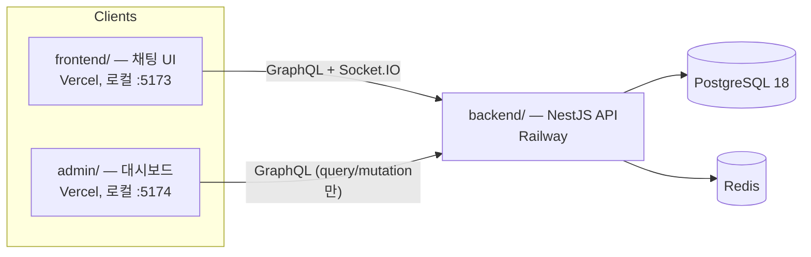
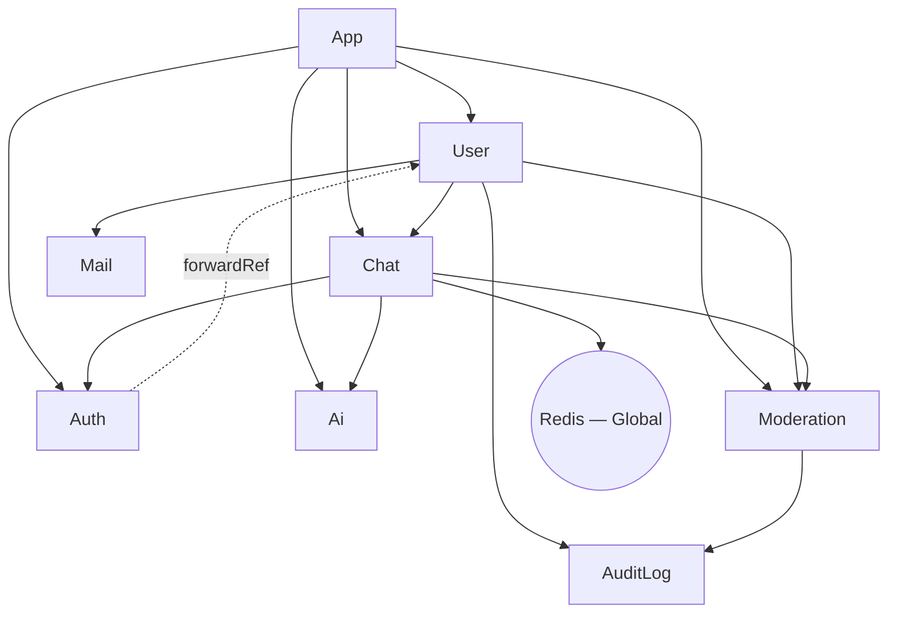
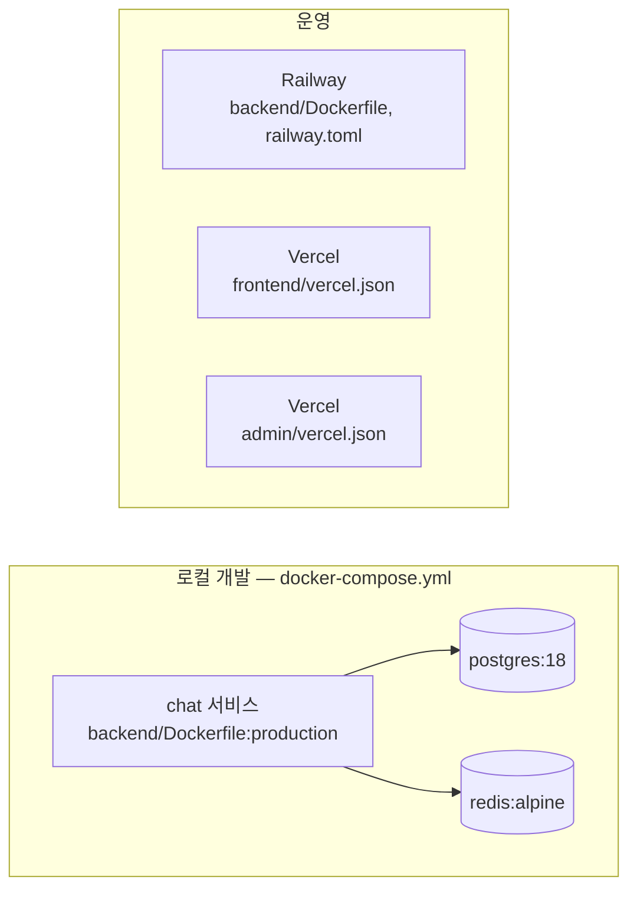

# 아키텍처

이 문서는 [README.md](README.md)의 기술 심화 버전입니다. README는 프로젝트 소개, 빠른 시작, 기능 목록을
다루고, [CLAUDE.md](CLAUDE.md)는 AI 에이전트 컨벤션과 가드레일을 다룹니다. 이 문서는 그 두 문서가 충분히
다루지 않는 부분 — 모듈 의존성 그래프, 가드 체인 구성, 배포 토폴로지 — 를 다룹니다. README가 이미 잘
정리한 내용(프로젝트 구조 트리, 엔티티 관계, `sendMessage` 데이터 흐름)은 다시 쓰지 않고 링크로
대신하여 두 문서가 서로 어긋나지 않도록 합니다.

## 시스템 컨텍스트

세 개의 배포 단위가 하나의 PostgreSQL 데이터베이스와 하나의 Redis 인스턴스를 공유합니다.

`admin/`에는 실시간 클라이언트가 없습니다(`package.json`에 `graphql-ws`/`socket.io-client`가 없음) —
채팅 참여자가 아니라 query/mutation 전용 관리 화면입니다.

## 모노레포 구조

pnpm 워크스페이스로 세 패키지를 구성합니다: `backend/`(NestJS API, Postgres/Redis와 통신하는 유일한
배포 단위), `frontend/`(채팅 클라이언트), `admin/`(관리 대시보드). 전체 디렉터리 트리는 README의
[프로젝트 구조](README.ko.md#프로젝트-구조) 절을 참고하세요.

## 모듈 의존성 그래프

`backend/src/*/*.module.ts` 각 파일의 `imports`/`exports`를 직접 확인한 결과입니다.

| 모듈 | Imports | Exports | 비고 |
|---|---|---|---|
| `AppModule` | Config, TypeORM, GraphQL, `UserModule`, `ChatModule`, `AuthModule`, `AiModule`, `ModerationModule` | — | 루트 |
| `UserModule` | `ChatModule`, `AuditLogModule`, `MailModule`, `ModerationModule` | `UserService` | |
| `ChatModule` | `AuthModule`, `RedisModule`, `AiModule`, `ModerationModule` | `ChatService`, `PubSubService` | |
| `AuthModule` | `PassportModule`, `JwtModule`, `forwardRef(() => UserModule)` | `AuthService` | `UserModule`과 순환 의존, `forwardRef`로 해소 |
| `AiModule` | TypeORM 피처만 | `AiService`, `AiRoomService` | 팩토리로 `GENAI_CLIENT` 제공 |
| `ModerationModule` | `AuditLogModule` | `ModerationService`, `ModerationGuard` | `ChatModule`을 **절대** import하지 않음 — 아래 참고 |
| `AuditLogModule` | TypeORM 피처만 | `AuditLogService` | |
| `MailModule` | — | `MailService` | |
| `RedisModule` | — | `REDIS_CLIENT`, `SessionCacheService` | `@Global()` |

**`ModerationModule`이 `ChatModule`을 import하지 않는 이유**: `ChatModule`이 이미 `ModerationModule`에
의존합니다(`sendMessage`의 `ModerationGuard`). 여기서 `ModerationModule`도 `ChatModule`에 의존하면
순환이 발생합니다. 대신 `ModerationService`는 채팅 쪽 side effect(`publishFn`, `disconnectFn`)를
`ChatResolver`가 호출 시점에 콜백으로 주입받습니다 — `AiService.handleReply()`와 동일한 패턴입니다.
`backend/src/moderation/moderation.module.ts:1-4`에 문서화되어 있습니다.

## 가드 체인

아래 모든 체인에서 순서는 의미를 가집니다 — 각 가드는 앞선 가드가 요청에 설정한 상태에 의존합니다.

| 대상 | 체인 | 위치 |
|---|---|---|
| REST(보호된 라우트) | `JwtAuthGuard` → `RbacGuard` | `user.controller.ts` |
| GraphQL, admin 전용 | `GraphQLAuthGuard` → `GraphQLRBACGuard` | `chat.resolver.ts` (주석: "`GraphQLAuthGuard`가 `req.user`를 채우고, `GraphQLRBACGuard`가 그것을 읽는다") |
| GraphQL, `sendMessage` | `GraphQLAuthGuard` → `ModerationGuard` → `RateLimitGuard` | `chat.resolver.ts:186-188` — `RateLimitGuard`가 뮤트/밴 당한 유저에게 속도 제한 예산을 소모하기 전에 `ModerationGuard`가 먼저 걸러야 함 |
| Socket.IO `handleConnection` | JWT 파싱 → `moderationService.isUserBanned()` 확인 | `chat.gateway.ts` — HTTP/GraphQL에서 `jwt.strategy`가 적용하는 것과 동일한 밴 게이트로, 유효한 토큰이라도 소켓 연결로는 밴을 우회할 수 없음 |

`ModerationGuard`(`moderation.guard.ts`) 자체는 밴/뮤트 상태만 확인하도록 의도적으로 얇게
설계되어 있습니다(SRP) — 스트라이크 누적과 실제 제재 side effect는 모두 `ModerationService`에 있습니다.

## 데이터 흐름

`sendMessage` GraphQL mutation 경로와 Socket.IO 연결 라이프사이클은 이미 README의
[흐름](README.ko.md#흐름) 절에 단계별로 도식화되어 있습니다 — 트랜잭션 경계, 커밋 이후 AI 응답 트리거,
Redis Pub/Sub 전달까지 그쪽이 정본입니다. 여기서 추가할 내용은 하나뿐입니다: `ModerationService.evaluateMessage()`가
같은 경로 안에서 가드 통과 이후·저장 이전에 실행되며, 경고/뮤트/밴 알림을 위한 시스템 메시지 발행도
사람이 보낸 메시지와 동일한 `receiveMessage :${roomId}` 채널로 이루어집니다 — CLAUDE.md의
[AI Reply Channel Parity](CLAUDE.md#chat--caching)를 그대로 재사용하는 것이며, 별도의 두 번째 전달
경로를 만들지 않습니다.

## 배포 토폴로지

- **로컬**: `docker compose up -d --build` — 서비스 3개(`chat`, `postgres:18`, `redis:alpine`), 모든
  포트는 `127.0.0.1`에만 바인딩됩니다(과거 `0.0.0.0`으로 노출되었던 사고가 있었습니다 — README의
  [AI-Assisted Development Notes](README.ko.md#ai-보조-개발-사례) 참고). `chat` 서비스는 시작 시
  `pnpm migration:run && node dist/main`을 실행하며, 이는 운영 환경과 동일합니다.
- **백엔드 / Railway**: `railway.toml`이 `backend/Dockerfile`(멀티스테이지)을 빌드하고, 동일한
  마이그레이션 후 시작 커맨드를 실행하며, 실패 시 최대 3회 재시작합니다. 배포는
  `.github/workflows/deploy.yml`의 `deploy` job이 `main` 브랜치 push에서만 트리거합니다.
- **프론트엔드 & 관리자 / Vercel**: 별개의 Vercel 프로젝트 두 개, 각자 자신의 `vercel.json`(SPA 리라이트
  뿐)과 백엔드 쪽 `CORS_ORIGIN` 항목을 가집니다(CLAUDE.md의 [CORS](CLAUDE.md#cors) 절 참고 — 이
  환경변수는 두 origin을 모두 포함하는 콤마 구분 리스트입니다).
- **Node/pnpm 고정 버전**: `.nvmrc` = `24`; `packageManager: pnpm@10.33.0`, 둘 다 CI에서 강제됩니다.

## 기술 스택

각 패키지의 실제 `dependencies`(`devDependencies` 제외)를 직접 확인한 목록입니다 — *왜* 이 선택을
했는지는 README의 [기술 스택](README.ko.md#기술-스택) 절이 다루고, 여기서는 `package.json`과 항상 맞는
*무엇을* 쓰는지만 다룹니다.

- **backend**: NestJS 11(`common`/`core`/`config`/`graphql`/`jwt`/`passport`/`platform-express`/
  `platform-socket.io`/`swagger`/`typeorm`/`websockets`), `@apollo/server` 5, `@google/genai`,
  `@socket.io/redis-adapter`, `bcrypt`, `class-validator`/`class-transformer`, `graphql` 16,
  `graphql-redis-subscriptions`, `ioredis`, `joi`, `nest-winston`/`winston`, `nodemailer`,
  `passport-jwt`, `pg`, `socket.io`/`socket.io-client`, `typeorm` 0.3, `cookie-parser`, `dotenv`.
- **frontend**: React 19, `@apollo/client` 4, `graphql-ws`, `socket.io-client`, `axios`, `dompurify`,
  `react-hook-form`, `react-router-dom` 7, `zustand`, `jwt-decode`.
- **admin**: React 19, `@apollo/client` 4, `axios`, `react-hook-form`, `react-router-dom` 7, `zustand`,
  `jwt-decode` — `graphql-ws`/`socket.io-client` 없음(query/mutation 전용, 실시간 구독 없음).

## 엔티티

필드 단위 상세 내용은 README의 [엔티티](README.ko.md#엔티티-typeorm) 절을 참고하세요
(`UserEntity`, `ChatEntity`, `RoomEntity`, `EntityBase`) — 이미 정확하고 최신 상태라 여기서 다시
쓰지 않습니다.

## 해결된 이상 항목

`backend/package.json`의 `dependencies`에는 한때 `redis`(v5 — 실제로 모든 곳에서 쓰이는 `ioredis`
외의 미사용 두 번째 Redis 클라이언트)와, 코드베이스 어디에서도 import되지 않는 `audit`, `lint`,
`pnpm`이 실제 설치 패키지로 들어가 있었습니다 — 넷 다 실수로 `pnpm add`한 것으로 보였습니다. 미사용
확인 후 제거했습니다.

## 관련 문서

- [README.md](README.md) — 소개, 빠른 시작, 기능, 전체 데이터 흐름
- [CLAUDE.md](CLAUDE.md) — AI 에이전트 컨벤션, Never Do 규칙, 아키텍처 결정
- [CONTRIBUTING.md](CONTRIBUTING.md) — 로컬 설정, 브랜치/커밋 컨벤션, PR 체크리스트
- [ADR/](ADR/) — CLAUDE.md의 Architecture Decisions 및 Project-Specific Principles 절을 공식 기록으로
  정리한 문서
- [ROADMAP.md](ROADMAP.md) — 향후 계획
- [CHANGELOG.md](CHANGELOG.md) — 전체 커밋 히스토리
