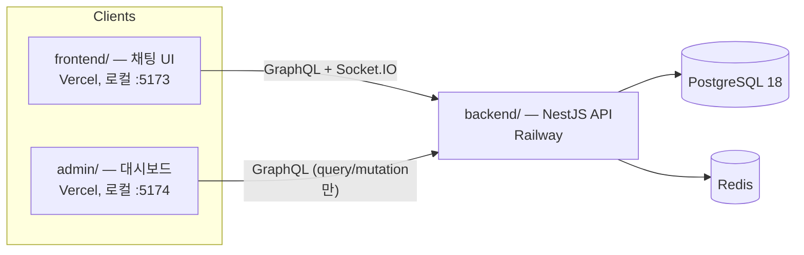
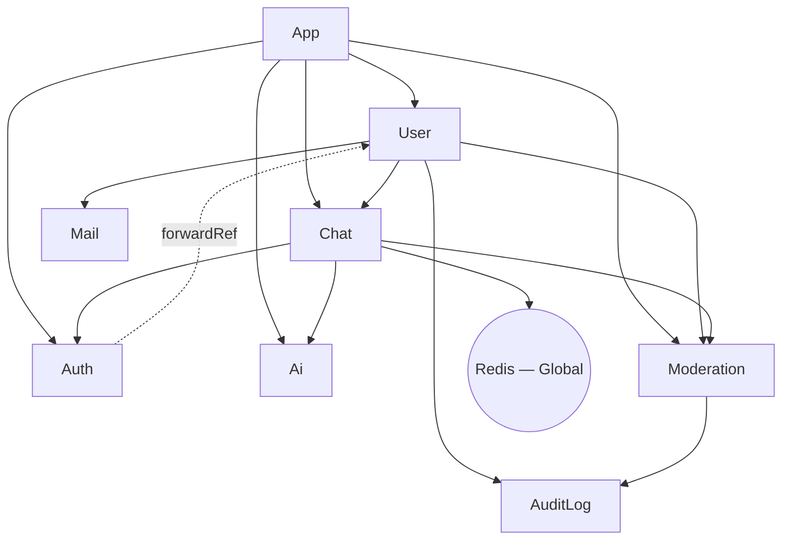
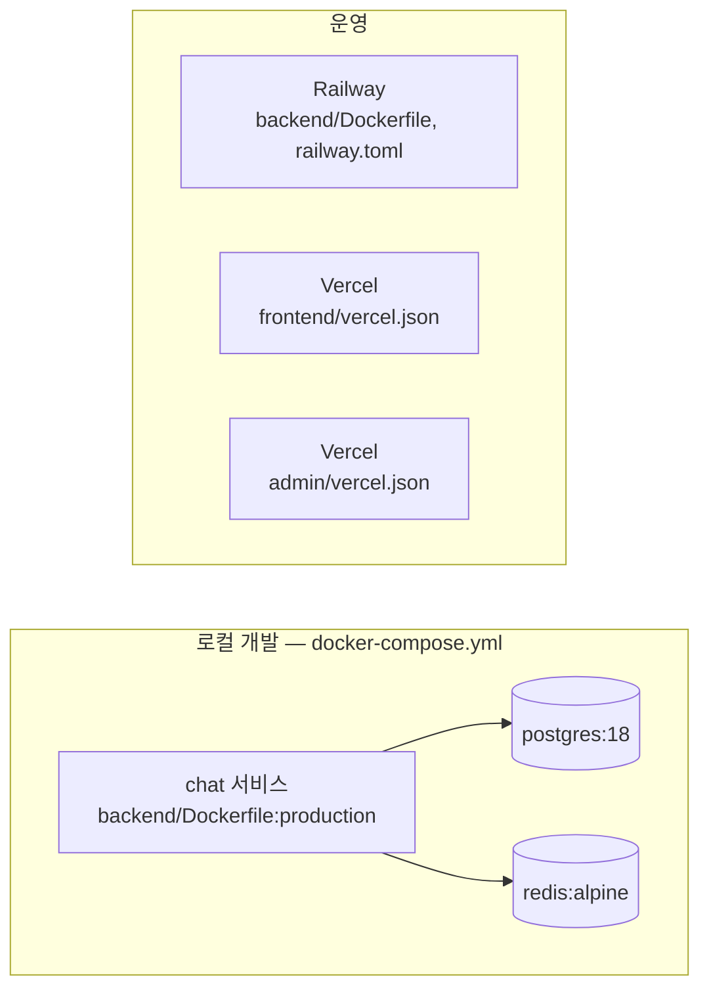

# 아키텍처

이 문서는 [README.md](README.md)의 기술 심화 버전입니다. README는 프로젝트 소개, 빠른 시작, 기능 목록을
다루고, [CLAUDE.md](CLAUDE.md)는 AI 에이전트 컨벤션과 가드레일을 다룹니다. 이 문서는 그 두 문서가 충분히
다루지 않는 부분 — 모듈 의존성 그래프, 가드 체인 구성, 전역 부트스트랩/에러 처리, 배포 토폴로지 — 를 다룹니다. README가 이미 잘
정리한 내용(프로젝트 구조 트리, 엔티티 관계, `sendMessage` 데이터 흐름)은 다시 쓰지 않고 링크로
대신하여 두 문서가 서로 어긋나지 않도록 합니다. 아래의 설계 의도 설명은 코드에 근거하거나, 코드만으로는
알 수 없는 부분은 개발자 본인이 밝힌 동기에 근거합니다 — 지어내지 않습니다.

## 시스템 컨텍스트

세 개의 배포 단위가 하나의 PostgreSQL 데이터베이스와 하나의 Redis 인스턴스를 공유합니다.

`admin/`에는 실시간 클라이언트가 없습니다(`package.json`에 `graphql-ws`/`socket.io-client`가 없음) —
채팅 참여자가 아니라 query/mutation 전용 관리 화면입니다.

## 모노레포 구조

pnpm 워크스페이스로 세 패키지를 구성합니다: `backend/`(NestJS API, Postgres/Redis와 통신하는 유일한
배포 단위), `frontend/`(채팅 클라이언트), `admin/`(관리 대시보드). 전체 디렉터리 트리는 README의
[프로젝트 구조](README.ko.md#프로젝트-구조) 절을 참고하세요.

- **이유:** 1인 프로젝트 규모 — 개발자 한 명이 GraphQL 계약을 공유하는 패키지 3개를 관리할 때는, 별도
  저장소 세 개를 조율하는 것보다 모노레포 쪽 관리 오버헤드가 더 낮습니다(개발자 본인 표현: "1인
  프로젝트 규모에 적합하고, 관리가 편리하며, 관리 비용이 적음").

- **비용:** 루트의 `pnpm-lock.yaml` 하나가 세 패키지의 의존성 해석을 전부 묶고 있고, CI
  (`.github/workflows/deploy.yml`)는 변경된 경로 기준 필터링이 없어서 — 실제로 어느 패키지가
  바뀌었든 매 push마다 `backend`와 `admin` lint+test가 둘 다 돕니다.

- **위험:** 지금 규모(개발자 1명, 패키지 3개)에서는 낮지만, 팀이나 패키지 수가 늘어나면 커집니다 —
  Nx/Turborepo류의 영향받은-패키지만 필터링하는 표준적인 완화책은 아직 없습니다.

[ADR 0008](ADR/0008-pnpm-monorepo-layout.md)로 정식화되어 있습니다.

## 모듈 의존성 그래프

`backend/src/*/*.module.ts` 각 파일의 `imports`/`exports`를 직접 확인한 결과입니다.

| 모듈 | Imports | Exports | 비고 |
|---|---|---|---|
| `AppModule` | Config, TypeORM, GraphQL, `UserModule`, `ChatModule`, `AuthModule`, `AiModule`, `ModerationModule` | — | 루트 |
| `UserModule` | `ChatModule`, `AuditLogModule`, `MailModule`, `ModerationModule` | `UserService` | |
| `ChatModule` | `AuthModule`, `RedisModule`, `AiModule`, `ModerationModule` | `ChatService`, `PubSubService` | |
| `AuthModule` | `PassportModule`, `JwtModule`, `forwardRef(() => UserModule)` | `AuthService` | `UserModule`과 순환 의존, `forwardRef`로 해소 |
| `AiModule` | TypeORM 피처만 | `AiService`, `AiRoomService` | 팩토리로 `GENAI_CLIENT` 제공 |
| `ModerationModule` | `AuditLogModule` | `ModerationService`, `ModerationGuard` | `ChatModule`을 **절대** import하지 않음 — 아래 참고 |
| `AuditLogModule` | TypeORM 피처만 | `AuditLogService` | |
| `MailModule` | — | `MailService` | |
| `RedisModule` | — | `REDIS_CLIENT`, `SessionCacheService` | `@Global()` |

**`ModerationModule`이 `ChatModule`을 import하지 않는 이유**: `ChatModule`이 이미 `ModerationModule`에
의존합니다(`sendMessage`의 `ModerationGuard`). 여기서 `ModerationModule`도 `ChatModule`에 의존하면
순환이 발생합니다. 대신 `ModerationService`는 채팅 쪽 side effect(`publishFn`, `disconnectFn`)를
`ChatResolver`가 호출 시점에 콜백으로 주입받습니다 — `AiService.handleReply()`와 동일한 패턴입니다.
`backend/src/moderation/moderation.module.ts:1-4`에 문서화되어 있으며, [ADR 0006](ADR/0006-moderation-one-directional-dependency.md)으로 공식화되어 있습니다.

- **비용:** 채팅 쪽 효과가 필요한 `ModerationService`의 메서드(예: `evaluateMessage`)는 서비스를
  직접 주입받는 대신 콜백 모양의 파라미터(`ModerationCallbacks`)를 받아야 합니다 — 호출부마다
  파라미터가 하나 더 필요하고, 결합관계도 일반 import보다 눈에 덜 띕니다.

- **위험:** 이 코드베이스는 이미 다른 곳에서 순환 의존 하나를 `forwardRef`로 허용하고 있습니다(위
  표의 `AuthModule` ↔ `UserModule`) — 그러니 여기서 우려하는 건 "NestJS가 두 번째 순환을 못
  다룬다"가 아닙니다(`forwardRef`로 되긴 됩니다). 문제는 순환 하나가 더 생기면 모듈 그래프를
  이해하기가 실질적으로 더 어려워지고 리팩터링에도 더 취약해지는데, 이미 `AiService`로 검증된 콜백
  패턴 대비 그럴 이득이 없다는 것입니다.

## 전역 부트스트랩 설정

`main.ts`에 한 번 등록되어 모듈과 무관하게 모든 라우트에 적용되는 횡단 관심사 설정입니다:

- **전역 `ValidationPipe`** (`main.ts:32-41`) — `whitelist: true` + `forbidNonWhitelisted: true`(대상
  DTO 클래스에 선언되지 않은 속성은 제거/거부)와 `transform: true`(들어온 페이로드를 DTO 클래스
  인스턴스로 변환)로 설정되어 있습니다. CLAUDE.md의 Never Do Group 3 "Raw `@Body()` without DTO" 규칙이
  실제로 강제되는 지점입니다 — DTO 타입으로 선언된 모든 컨트롤러/리졸버 인자에 대한 검증이 엔드포인트마다
  다시 구현되지 않고 여기서 한 번에 이루어집니다.
- **`app.enableShutdownHooks()`** (`main.ts:21`) — 이게 없으면 `OnModuleDestroy` 훅
  (`PubSubService`, `SessionCacheService`, `ChatGateway`)이 `SIGTERM`/`SIGINT`에서 실행되지 않아, 배포할
  때마다 Redis 연결이 정상 종료 대신 거칠게 끊깁니다(`main.ts:18-20`의 코드 주석 근거).
- **Body 파서 한도를 3mb로 상향** (`main.ts:27-30`, `json`/`urlencoded` 둘 다) — Express 기본값(100kb)은
  사용자가 업로드하는 base64 이미지보다 훨씬 작다는 것이 근거입니다(`main.ts:27-28` 코드 주석). 이
  한도를 넘는 요청을 잡아내는 것이 바로 아래 [에러 처리](#에러-처리)의 `AllExceptionsFilter`
  payload-too-large → `413` 분기입니다.

## 에러 처리

`AllExceptionsFilter`(`backend/src/base/filter/all-exceptions.filter.ts`)는 HTTP와 GraphQL을 모두
커버하는 단일 전역 필터로 등록되어 있습니다(`app.useGlobalFilters(new AllExceptionsFilter())`,
`main.ts:25`) — 필터를 둘로 나누는 대신 `host.getType<'http' | 'ws' | 'graphql'>()`으로 분기합니다.
`HttpException`이 아닌 에러는 기본적으로 `500`/`INTERNAL_SERVER_ERROR`로 처리되지만, 예외적으로
`body-parser`의 "entity.too.large" 에러만은 구조적으로 감지해서(`body-parser`가 일반 `Error`를 던지므로
`instanceof HttpException`으로는 구분이 안 됨) `413 PAYLOAD_TOO_LARGE`로 재매핑합니다. 운영 환경
(`NODE_ENV === 'production'`)에서는 HTTP JSON 바디와 GraphQL 에러의 `extensions` 양쪽 모두에서 스택
트레이스가 빠집니다 — CLAUDE.md의 Never Do Group 3 "Stack trace in error response" 규칙의 실제
구현체입니다.

- **사용자 노출 메시지가 한국어로 하드코딩된 부분**: payload-too-large 메시지
  (`'이미지 용량 크기가 너무 커요!'`)만 이 필터의 다른 메시지들이나 주변 코드베이스/문서(영어)와 달리
  한국어로 되어 있습니다. 확인 결과 의도적이며 실수가 아닙니다 — 이용자가 한국인이라는 가정 하에
  작성되었고, 향후 영미권 이용자를 위한 영문 번역 기능을 추가할 때까지 임시로 추출되지 않은 채
  남겨둔 것입니다(개발자 본인 확인). CLAUDE.md의 [Internationalization (i18n)](CLAUDE.md#internationalization-i18n)
  절 참고 — 이 문자열이 바로 그 절에서 말하는, i18n 라이브러리가 도입되면 추출 대상이 될 인라인 UI
  텍스트에 해당합니다.

## 가드 체인

아래 모든 체인에서 순서는 의미를 가집니다 — 각 가드는 앞선 가드가 요청에 설정한 상태에 의존합니다.

| 대상 | 체인 | 위치 |
|---|---|---|
| REST(보호된 라우트) | `JwtAuthGuard` → `RbacGuard` | `user.controller.ts` |
| GraphQL, admin 전용 | `GraphQLAuthGuard` → `GraphQLRBACGuard` | `chat.resolver.ts` (주석: "`GraphQLAuthGuard`가 `req.user`를 채우고, `GraphQLRBACGuard`가 그것을 읽는다") |
| GraphQL, `sendMessage` | `GraphQLAuthGuard` → `ModerationGuard` → `RateLimitGuard` | `chat.resolver.ts:186-188` — `RateLimitGuard`가 뮤트/밴 당한 유저에게 속도 제한 예산을 소모하기 전에 `ModerationGuard`가 먼저 걸러야 함 |
| Socket.IO `handleConnection` | JWT 파싱 → `moderationService.isUserBanned()` 확인 | `chat.gateway.ts` — HTTP/GraphQL에서 `jwt.strategy`가 적용하는 것과 동일한 밴 게이트로, 유효한 토큰이라도 소켓 연결로는 밴을 우회할 수 없음 |
| GraphQL, `receiveMessage` 구독 | `GraphQLAuthGuard` → `isRoomParticipant()` 룸 멤버십 확인 | `chat.resolver.ts:309-326` |

**`receiveMessage`는 HTTP가 아니라 `graphql-ws` 위에서 동작합니다** — 이 표에서 유일하게 그런
경로입니다. `GraphQLAuthGuard`는 `ctx.req.headers.authorization`을 읽는데, 구독에는 실제 HTTP
요청이 없습니다 — GraphQL `context()` 함수(`app.module.ts:88-119`)가 `graphql-ws`의
`connectionParams`(`onConnect`에서 캡처되어 `extra`로 전달됨)로부터 synthetic한
`req.headers.authorization`을 만들어냅니다. 이게 실제 메시지 *전달* 쪽 가드입니다 — `sendMessage`의
가드 체인(위)은 쓰기 쪽만 막고, 모든 구독자는 구독 시점에 인증과 룸 멤버십을 각자 독립적으로
다시 증명합니다. 즉 구독 이후 토큰이 폐기되거나 방에서 나가도 스트림 도중에는 재확인되지
않습니다(체크는 `receiveMessage` 호출 시점에 한 번만 실행되고, 전달되는 메시지마다 실행되지
않음).

`ModerationGuard`(`moderation.guard.ts`) 자체는 밴/뮤트 상태만 확인하도록 의도적으로 얇게
설계되어 있습니다(SRP) — 스트라이크 누적과 실제 제재 side effect는 모두 `ModerationService`에 있습니다.

- **`sendMessage` 순서 자체의 비용/위험:** `ModerationGuard`의 체크는 대부분 이미 로드된 데이터(밴
  상태)를 보는 저렴한 체크에 Redis `GET` 한 번(뮤트 상태)이 더해진 정도입니다. `RateLimitGuard`
  (`rate-limit.guard.ts`)는 Redis에 Lua 스크립트(`INCR` + 조건부 `EXPIRE`)를 실행합니다. 저렴한
  체크를 먼저 두면 이미 밴된 유저가 엔드포인트를 두드려도 더 비싼 속도 제한 연산까지는 도달하지
  않습니다. 순서를 뒤집으면 밴된 유저의 재시도 폭주가 어차피 거부될 요청에 Redis 자원을 쓰게 되고,
  이미 밴된 계정에 `recordVelocityViolation`으로 불필요한 추가 스트라이크가 쌓일 수도 있습니다.

## 데이터 흐름

`sendMessage` GraphQL mutation 경로와 Socket.IO 연결 라이프사이클은 이미 README의
[흐름](README.ko.md#흐름) 절에 단계별로 도식화되어 있습니다 — 트랜잭션 경계, 커밋 이후 AI 응답 트리거,
Redis Pub/Sub 전달까지 그쪽이 정본입니다. 트랜잭션 경계 결정 자체는
[ADR 0003](ADR/0003-database-transaction-strategy.md)으로 공식화되어 있습니다. 여기서 추가할 내용은
하나뿐입니다: `ModerationService.evaluateMessage()`가
같은 경로 안에서 가드 통과 이후·저장 이전에 실행되며, 경고/뮤트/밴 알림을 위한 시스템 메시지 발행도
사람이 보낸 메시지와 동일한 `receiveMessage :${roomId}` 채널로 이루어집니다 — CLAUDE.md의
[AI Reply Channel Parity](CLAUDE.md#chat--caching)를 그대로 재사용하는 것이며, 별도의 두 번째 전달
경로를 만들지 않습니다. 커밋 이후 AI 응답 트리거(`AiService.handleReply()`)는 응답을 생성하기 전에
룸 단위 Redis 락을 획득합니다 — 왜 큐잉이 아니라 스킵 방식의 락을, 왜 룸 단위 정밀도를 선택했는지는
[ADR 0007](ADR/0007-ai-reply-distributed-lock.md) 참고.

- **위험:** `evaluateMessage()`는 `pubSub.publish()`가 이미 구독자에게 메시지를 전달한 *이후*에
  실행되는 `setImmediate` 블록 안에 있습니다(`chat.resolver.ts:206`의 발행이 모더레이션 블록보다
  먼저 시작됩니다). 즉 위반 메시지 자체는 전달 전에 절대 차단되지 않고, 뮤트/밴이 발동된 *이후*에
  보낸 메시지만 막힙니다. 이건 의도된 지연 시간 트레이드오프이지(모더레이션 평가가 `sendMessage`에
  왕복 시간을 더하지 않음) 실수가 아니지만, 스트라이크를 유발한 그 메시지에 대해서는 모더레이션이
  사전 예방이 아니라 전달 후 사후 대응이라는 뜻이기도 합니다.

## 배포 토폴로지

- **로컬**: `docker compose up -d --build` — 서비스 3개(`chat`, `postgres:18`, `redis:alpine`), 모든
  포트는 `127.0.0.1`에만 바인딩됩니다(과거 `0.0.0.0`으로 노출되었던 사고가 있었습니다 — README의
  [AI-Assisted Development Notes](README.ko.md#ai-보조-개발-사례) 참고). `chat` 서비스는 시작 시
  `pnpm migration:run && node dist/main`을 실행하며, 이는 운영 환경과 동일합니다.

  - **되돌렸을 때의 위험:** 이미 문서화된 바로 그 사고입니다 — 공인 IP를 가진 머신에서 개발용
    포트가 노출되어 랜섬웨어 봇이 개발 DB를 지웠습니다.

  - **유지하는 비용:** LAN 안의 다른 기기(예: 휴대폰으로 테스트)에서 개발 서버에 접근하려면 단순
    IP:포트 대신 SSH 터널이나 명시적 포트 포워딩이 필요합니다 — 이미 검증된 공격 경로를 막는
    대가로 감수하는, 실재하지만 작은 불편입니다.

  전체 내용은 [ADR 0013](ADR/0013-local-dev-network-binding.md) 참고.

- **백엔드 / Railway**: `railway.toml`이 `backend/Dockerfile`(멀티스테이지)을 빌드하고, 동일한
  마이그레이션 후 시작 커맨드를 실행하며, 실패 시 최대 3회 재시작합니다. 배포는
  `.github/workflows/deploy.yml`의 `deploy` job이 `main` 브랜치 push에서만 트리거합니다.

- **프론트엔드 & 관리자 / Vercel**: 별개의 Vercel 프로젝트 두 개, 각자 자신의 `vercel.json`(SPA
  리라이트뿐)과 백엔드 쪽 `CORS_ORIGIN` 항목을 가집니다(CLAUDE.md의 [CORS](CLAUDE.md#cors) 절
  참고 — 이 환경변수는 두 origin을 모두 포함하는 콤마 구분 리스트입니다).

  `admin`이 애초에(`frontend`의 보호된 라우트가 아니라) 별도 앱으로 존재하는 이유는
  [ADR 0009](ADR/0009-admin-separate-app.md)로 정식화되어 있습니다.

- **왜 Railway + Vercel인가**: 개인 프로젝트에 충분한 무료/저비용 티어, 그리고 두 플랫폼 모두
  GitHub push로 바로 배포되는 편의성.

  - **비용/위험:** 플랫폼이 둘로 나뉘어 있어 로그·메트릭이 대시보드 두 곳에 흩어집니다(관측성
    분산). `frontend`/`admin`을 (하나가 아니라) 별도의 Vercel 프로젝트 두 개로 두면 유지해야 할
    CORS 표면도 두 배가 됩니다(`CORS_ORIGIN`을 설정하는 모든 곳에서 두 origin을 다 나열해야 함) —
    이는 두 앱이 실제로 독립적인 배포 주기를 가져야 하기 때문에 받아들인 대가입니다
    ([ADR 0005](ADR/0005-cors-multi-origin-policy.md) 참고).

[ADR 0010](ADR/0010-railway-vercel-deployment.md)에 Railway + Vercel 선택의 전체 내용이 있습니다.

- **Node/pnpm 고정 버전**: `.nvmrc` = `24`; `packageManager: pnpm@10.33.0`, 둘 다 CI에서 강제됩니다.

## 기술 스택

각 패키지의 실제 `dependencies`(`devDependencies` 제외)를 직접 확인한 목록이며, `package.json`과
항상 맞습니다. 이 선택들의 원래 근거는 README의 [기술 스택](README.ko.md#기술-스택) 절이 다루고,
아래에서는 주요 아키텍처 선택마다 README의 기술 스택 절엔 없는 비용/위험도 함께 다룹니다.

- **backend**: NestJS 11(`common`/`core`/`config`/`graphql`/`jwt`/`passport`/`platform-express`/
  `platform-socket.io`/`swagger`/`typeorm`/`websockets`), `@apollo/server` 5, `@google/genai`,
  `@socket.io/redis-adapter`, `bcrypt`, `class-validator`/`class-transformer`, `graphql` 16,
  `graphql-redis-subscriptions`, `ioredis`, `joi`, `nest-winston`/`winston`, `nodemailer`,
  `passport-jwt`, `pg`, `socket.io`/`socket.io-client`, `typeorm` 0.3, `cookie-parser`, `dotenv`.

- **frontend**: React 19, `@apollo/client` 4, `graphql-ws`, `socket.io-client`, `axios`, `dompurify`,
  `react-hook-form`, `react-router-dom` 7, `zustand`, `jwt-decode`.

- **admin**: React 19, `@apollo/client` 4, `axios`, `react-hook-form`, `react-router-dom` 7, `zustand`,
  `jwt-decode` — `graphql-ws`/`socket.io-client` 없음(query/mutation 전용, 실시간 구독 없음).

### 주요 선택 — 비용/위험

- **백엔드 프레임워크로 NestJS**

  - **실제로 발생한 위험:** Docker의 Alpine Linux 안에서 `@nestjs/cli`의 빌드 단계가 pnpm의
    심볼릭 링크 기반 `node_modules` 구조와 충돌해서 심볼릭 링크를 만들지 못했고, 테스트 빌드
    자체가 완전히 깨졌습니다 — `backend/Dockerfile`에서 디버깅 후 수정(2026-05-29). 가상의
    호환성 우려가 아니라, 이 저장소에서 실제로 빌드를 깨뜨렸던 툴체인 상호작용입니다.

- **Socket.IO(연결 라이프사이클) + GraphQL(메시징)**

  - **비용:** 새로운 메시지 전달 사례가 생길 때마다 별도 경로를 추가하는 게 아니라 기존의 단일
    `PubSubService.publish()` 채널을 거쳐야 합니다 — 이 분리 자체를 완전히 정착시키는 데만 약
    5개월이 걸렸습니다([ROADMAP의 빌드 타임라인](ROADMAP.ko.md#빌드-타임라인-2026-01--2026-07) 참고).

  - **위험:** Redis Pub/Sub는 최대 한 번 전달(at-most-once)이라, 발행 시점에 연결이 끊긴 구독자는
    그 메시지를 영구히 놓칩니다. 전체 내용은 [ADR 0004](ADR/0004-graphql-socketio-api-layer-split.md)
    참고.

- **PostgreSQL + TypeORM**

  - **비용:** `migration:generate`에 이 저장소 특유의 알려진 결함이 있습니다 — participants
    조인테이블에 대해 가짜 FK drop/re-add를 다시 뱉어내서, 생성된 마이그레이션마다 수동으로
    걷어내야 합니다(CLAUDE.md의 Database 절 참고).

  - **위험:** 이 단계를 잊으면 유저 삭제 시 `ON DELETE CASCADE`가 조용히 깨지고, 실제로 누군가
    유저를 삭제해볼 때까지 드러나지 않습니다.

- **ioredis 기반 Redis**

  - **별도의 클라이언트 인스턴스 3개**, 하나로 공유되는 연결이 아닙니다: `REDIS_CLIENT`(`redis.module.ts`,
    `SessionCacheService`가 사용), `pubClient`/`subClient`(`chat.gateway.ts`의 `afterInit`,
    `@socket.io/redis-adapter`용) — 여기에 `PubSubService`를 위해 `graphql-redis-subscriptions`가
    내부적으로 여는 연결까지 더해집니다(CLAUDE.md의 Cache 절 참고: "pub/sub uses a dedicated
    subscriber connection"). `redis.module.ts`와 `chat.gateway.ts`는 각각 독립적으로 `REDIS_URL`을
    파싱하고 `rediss:`를 감지해 TLS를 켭니다 — 연결 설정 로직(host/port/password/TLS 추출)이 공유되지
    않고 두 파일에 그대로 중복되어 있습니다.

  - **비용:** Redis를 건드리는 캐시/세션 키는 새로 만들 때마다 `{service}:{entity}:{id}` 네이밍
    컨벤션을 따르고 TTL을 명시해야 합니다 — 작지만 모든 호출 지점에서 빠뜨리면 안 되는 추가
    단계입니다.

  - **위험:** TTL을 빠뜨리면 메모리가 무한정 늘어날 위험이 있고([해결된 이상 항목](#해결된-이상-항목)
    참고), `ioredis` 외에 두 번째 Redis 클라이언트를 같이 두면 어느 쪽이 진짜인지 모호해집니다 —
    실제로 이번 정비 전에 이미 그런 일이 사고로 일어났었습니다. 전체 내용은
    [ADR 0002](ADR/0002-redis-cache-conventions.md) 참고.

- **Google Gemini(AI)**

  - **비용:** 토큰 단위 과금이라 프롬프트 크기나 재시도가 무제한이면 비용으로 바로 직결됩니다 —
    이미 적용된 토큰/이력/재시도 상한(`ai.service.ts`)으로 완화하고 있습니다.

  - **위험:** 서드파티 API 장애나 rate limit이 걸리면 AI 응답이 조용히 멈춥니다 — 이미 크래시가
    아니라 잡아서 로깅하고 건너뛰는 방식으로 처리되어 있어, 장애 모드가 "AI 응답 없음"이지 "채팅
    자체가 깨짐"이 아닙니다.

  전체 내용은 [ADR 0011](ADR/0011-gemini-ai-provider.md) 참고 — 왜 다른 제공자가 아니라
  Gemini인지도 여기 포함되어 있습니다.

- **JWT + Passport(인증)**

  - **비용:** 새 `accessToken`이 필요한 클라이언트는 리프레시 엔드포인트를 직접 호출하는 대신
    공용 `refreshAccessTokenSafely()` 함수를 반드시 거쳐야 합니다 — 새 호출부마다 알아야 하는 한
    단계의 간접 호출이 추가됩니다.

  - **위험:** `accessToken`을 메모리가 아닌 다른 곳(예: `localStorage`)에 저장하거나 공용 리프레시
    함수를 우회하면, 이 설계가 막으려던 XSS/CSRF 노출과 리프레시 경합 문제가 다시 열립니다. 전체
    내용은 [ADR 0001](ADR/0001-jwt-auth-token-strategy.md) 참고.

## 엔티티

필드 단위 상세 내용은 README의 [엔티티](README.ko.md#엔티티-typeorm) 절을 참고하세요
(`UserEntity`, `ChatEntity`, `RoomEntity`, `AiRoomEntity`, `EntityBase`) — 최신 상태로 유지되고
있으므로 여기서 다시 쓰지 않습니다.

**`RoomEntity`에서 분리된 `AiRoomEntity`**: 방의 활성 AI 성격은 원래 `RoomEntity` 위에 직접 있는
nullable `aiPersonality` 컬럼이었습니다. 마이그레이션 `ExtractAiPersonalityToAiRoomEntity`
(`1749639600000`)가 이를 별도의 `AiRoomEntity`(`RoomEntity`로의 `OneToOne`, `onDelete: 'CASCADE'`)로
옮겼습니다.

- **이유:** AI 전용 방 상태와 일반 방 상태 사이의 관심사 분리, 그리고 그 데이터를 더 깔끔하게
  관리하기 위함입니다(개발자 본인 확인).

[ADR 0012](ADR/0012-airoomentity-split.md)로 정식화되어 있습니다.

## 해결된 이상 항목

`backend/package.json`의 `dependencies`에는 한때 `redis`(v5 — 실제로 모든 곳에서 쓰이는 `ioredis`
외의 미사용 두 번째 Redis 클라이언트)와, 코드베이스 어디에서도 import되지 않는 `audit`, `lint`,
`pnpm`이 실제 설치 패키지로 들어가 있었습니다 — 넷 다 실수로 `pnpm add`한 것으로 보였습니다. 미사용
확인 후 제거했습니다.

- **플래그만 남기지 않고 고칠 만했던 위험:** `ioredis`와 나란히 미사용 `redis` 클라이언트가
  설치되어 있는 상태는, 미래의 기여자(또는 AI 어시스턴트)가 잘못된 쪽을 import하게 만들기 딱 좋은
  종류의 모호함입니다. 게다가 설치된 패키지는 쓰든 안 쓰든 전부 공격 표면이라 `pnpm
  audit`/Dependabot이 플래그를 걸고 누군가는 그걸 확인해야 합니다. `audit`/`lint`/`pnpm`은 리터럴
  패키지로서 아무 기능도 제공하지 않고, lockfile만 부풀리고 이게 실제로 필요한 것인지 혼란만
  더했습니다.

## 관련 문서

- [README.md](README.md) — 소개, 빠른 시작, 기능, 전체 데이터 흐름
- [CLAUDE.md](CLAUDE.md) — AI 에이전트 컨벤션, Never Do 규칙, 아키텍처 결정
- [CONTRIBUTING.md](CONTRIBUTING.md) — 로컬 설정, 브랜치/커밋 컨벤션, PR 체크리스트
- [ADR/](ADR/) — CLAUDE.md의 Architecture Decisions 및 Project-Specific Principles 절을 공식 기록으로
  정리한 문서
- [ROADMAP.md](ROADMAP.md) — 향후 계획
- [CHANGELOG.md](CHANGELOG.md) — 전체 커밋 히스토리
