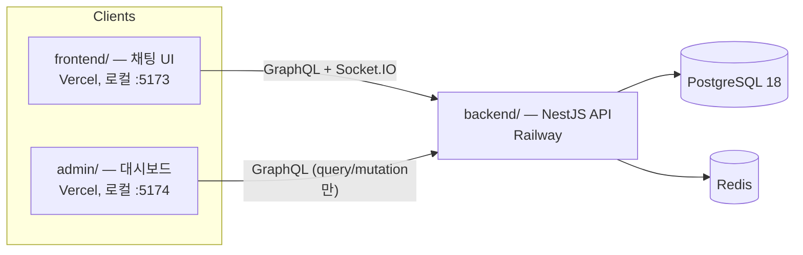
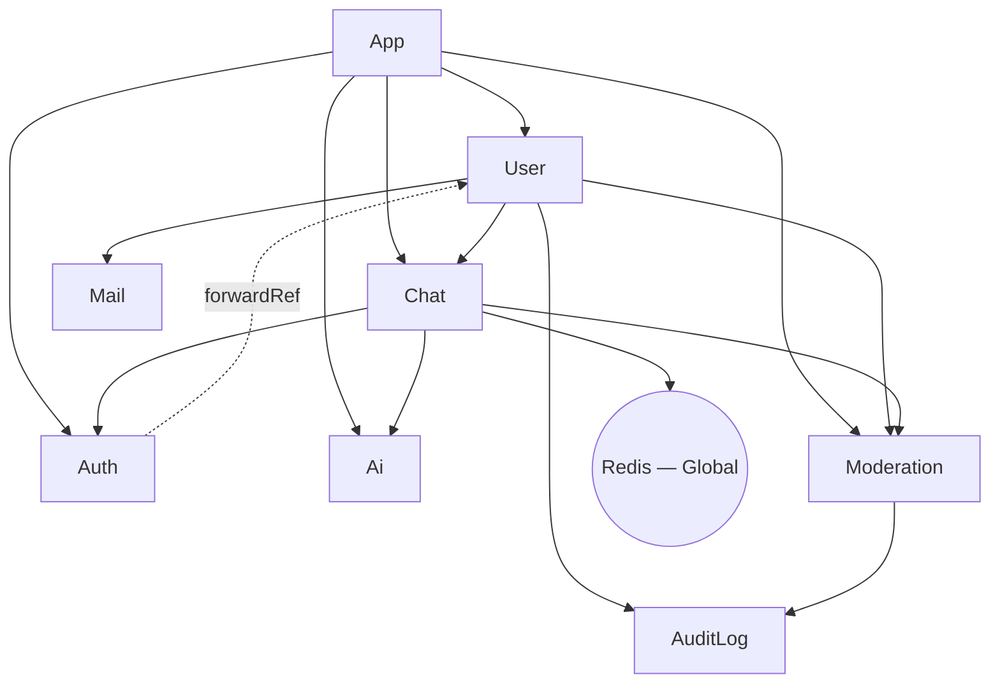
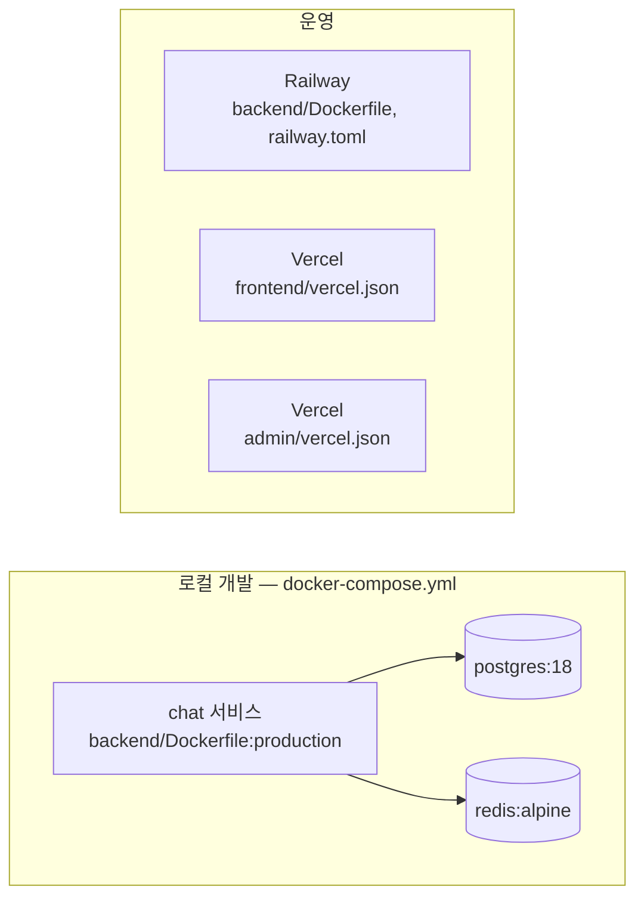

# 아키텍처

이 문서는 [README.md](README.md)의 기술 심화 버전입니다. README는 프로젝트 소개, 빠른 시작, 기능 목록을
다루고, [CLAUDE.md](CLAUDE.md)는 AI 에이전트 컨벤션과 가드레일을 다룹니다. 이 문서는 그 두 문서가 충분히
다루지 않는 부분 — 모듈 의존성 그래프, 가드 체인 구성, 배포 토폴로지 — 를 다룹니다. README가 이미 잘
정리한 내용(프로젝트 구조 트리, 엔티티 관계, `sendMessage` 데이터 흐름)은 다시 쓰지 않고 링크로
대신하여 두 문서가 서로 어긋나지 않도록 합니다. 아래의 설계 의도 설명은 코드에 근거하거나, 코드만으로는
알 수 없는 부분은 개발자 본인이 밝힌 동기에 근거합니다 — 지어내지 않습니다.

## 시스템 컨텍스트

세 개의 배포 단위가 하나의 PostgreSQL 데이터베이스와 하나의 Redis 인스턴스를 공유합니다.

`admin/`에는 실시간 클라이언트가 없습니다(`package.json`에 `graphql-ws`/`socket.io-client`가 없음) —
채팅 참여자가 아니라 query/mutation 전용 관리 화면입니다.
*비용:* 의존성 하나가 줄고, 인증 표면도 단순해집니다 — WS 핸드셰이크/재연결 로직을 유지할 필요가
없습니다.
*위험:* 나중에 관리자 패널에 실시간 모더레이션 알림 같은 기능이 필요해지면, 기존 것을 확장하는 게
아니라 구독 클라이언트를 새로 붙이는 개조 작업이 됩니다.

## 모노레포 구조

pnpm 워크스페이스로 세 패키지를 구성합니다: `backend/`(NestJS API, Postgres/Redis와 통신하는 유일한
배포 단위), `frontend/`(채팅 클라이언트), `admin/`(관리 대시보드). 전체 디렉터리 트리는 README의
[프로젝트 구조](README.ko.md#프로젝트-구조) 절을 참고하세요.

*이유:* 1인 프로젝트 규모 — 개발자 한 명이 GraphQL 계약을 공유하는 패키지 3개를 관리할 때는, 별도
저장소 세 개를 조율하는 것보다 모노레포 쪽 관리 오버헤드가 더 낮습니다(개발자 본인 표현: "1인
프로젝트 규모에 적합하고, 관리가 편리하며, 관리 비용이 적음").
*비용:* 루트의 `pnpm-lock.yaml` 하나가 세 패키지의 의존성 해석을 전부 묶고 있고, CI
(`.github/workflows/deploy.yml`)는 변경된 경로 기준 필터링이 없어서 — 실제로 어느 패키지가
바뀌었든 매 push마다 `backend`와 `admin` lint+test가 둘 다 돕니다.
*위험:* 지금 규모(개발자 1명, 패키지 3개)에서는 낮지만, 팀이나 패키지 수가 늘어나면 커집니다 —
Nx/Turborepo류의 영향받은-패키지만 필터링하는 표준적인 완화책은 아직 없습니다.

## 모듈 의존성 그래프

`backend/src/*/*.module.ts` 각 파일의 `imports`/`exports`를 직접 확인한 결과입니다.

| 모듈 | Imports | Exports | 비고 |
|---|---|---|---|
| `AppModule` | Config, TypeORM, GraphQL, `UserModule`, `ChatModule`, `AuthModule`, `AiModule`, `ModerationModule` | — | 루트 |
| `UserModule` | `ChatModule`, `AuditLogModule`, `MailModule`, `ModerationModule` | `UserService` | |
| `ChatModule` | `AuthModule`, `RedisModule`, `AiModule`, `ModerationModule` | `ChatService`, `PubSubService` | |
| `AuthModule` | `PassportModule`, `JwtModule`, `forwardRef(() => UserModule)` | `AuthService` | `UserModule`과 순환 의존, `forwardRef`로 해소 |
| `AiModule` | TypeORM 피처만 | `AiService`, `AiRoomService` | 팩토리로 `GENAI_CLIENT` 제공 |
| `ModerationModule` | `AuditLogModule` | `ModerationService`, `ModerationGuard` | `ChatModule`을 **절대** import하지 않음 — 아래 참고 |
| `AuditLogModule` | TypeORM 피처만 | `AuditLogService` | |
| `MailModule` | — | `MailService` | |
| `RedisModule` | — | `REDIS_CLIENT`, `SessionCacheService` | `@Global()` — *비용/위험:* 어떤 프로바이더든 `RedisModule`을 명시적으로 import하지 않고도 `REDIS_CLIENT`를 주입받을 수 있어 편리하지만, import만 봐서는 실제 의존 관계가 잘 안 보이게 됩니다 |

**`ModerationModule`이 `ChatModule`을 import하지 않는 이유**: `ChatModule`이 이미 `ModerationModule`에
의존합니다(`sendMessage`의 `ModerationGuard`). 여기서 `ModerationModule`도 `ChatModule`에 의존하면
순환이 발생합니다. 대신 `ModerationService`는 채팅 쪽 side effect(`publishFn`, `disconnectFn`)를
`ChatResolver`가 호출 시점에 콜백으로 주입받습니다 — `AiService.handleReply()`와 동일한 패턴입니다.
`backend/src/moderation/moderation.module.ts:1-4`에 문서화되어 있습니다.

*비용:* 채팅 쪽 효과가 필요한 `ModerationService`의 메서드(예: `evaluateMessage`)는 서비스를 직접
주입받는 대신 콜백 모양의 파라미터(`ModerationCallbacks`)를 받아야 합니다 — 호출부마다 파라미터가
하나 더 필요하고, 결합관계도 일반 import보다 눈에 덜 띕니다.
*위험:* 이 코드베이스는 이미 다른 곳에서 순환 의존 하나를 `forwardRef`로 허용하고 있습니다(위 표의
`AuthModule` ↔ `UserModule`) — 그러니 여기서 우려하는 건 "NestJS가 두 번째 순환을 못 다룬다"가
아닙니다(`forwardRef`로 되긴 됩니다). 문제는 순환 하나가 더 생기면 모듈 그래프를 이해하기가 실질적으로
더 어려워지고 리팩터링에도 더 취약해지는데, 이미 `AiService`로 검증된 콜백 패턴 대비 그럴 이득이
없다는 것입니다.

**`AuthModule` ↔ `UserModule`(기존 `forwardRef` 순환)**: 위 `ModerationModule` 사례와 달리 이 순환은
*받아들여졌습니다*. *비용:* `forwardRef`로 감싼 프로바이더는 두 모듈의 프로바이더가 모두 해석된
뒤에야 온전히 쓸 수 있다는, 일반 import보다 미묘한 초기화 순서 의존성을 갖습니다. *위험:* 이 순환
안의 어떤 프로바이더가 (부트스트랩 이후 호출되는 메서드 안이 아니라) 자기 생성자 안에서 상대 모듈의
서비스를 바로 쓰려 하면 아직 초기화 안 된 값을 만날 수 있습니다 — 지금까지 실제로 발생한 적은
없지만, `forwardRef` 순환이 흔히 갖는 버그 유형입니다.

## 가드 체인

아래 모든 체인에서 순서는 의미를 가집니다 — 각 가드는 앞선 가드가 요청에 설정한 상태에 의존합니다.

| 대상 | 체인 | 위치 |
|---|---|---|
| REST(보호된 라우트) | `JwtAuthGuard` → `RbacGuard` | `user.controller.ts` |
| GraphQL, admin 전용 | `GraphQLAuthGuard` → `GraphQLRBACGuard` | `chat.resolver.ts` (주석: "`GraphQLAuthGuard`가 `req.user`를 채우고, `GraphQLRBACGuard`가 그것을 읽는다") |
| GraphQL, `sendMessage` | `GraphQLAuthGuard` → `ModerationGuard` → `RateLimitGuard` | `chat.resolver.ts:186-188` — `RateLimitGuard`가 뮤트/밴 당한 유저에게 속도 제한 예산을 소모하기 전에 `ModerationGuard`가 먼저 걸러야 함 |
| Socket.IO `handleConnection` | JWT 파싱 → `moderationService.isUserBanned()` 확인 | `chat.gateway.ts` — HTTP/GraphQL에서 `jwt.strategy`가 적용하는 것과 동일한 밴 게이트로, 유효한 토큰이라도 소켓 연결로는 밴을 우회할 수 없음 |

`ModerationGuard`(`moderation.guard.ts`) 자체는 밴/뮤트 상태만 확인하도록 의도적으로 얇게
설계되어 있습니다(SRP) — 스트라이크 누적과 실제 제재 side effect는 모두 `ModerationService`에 있습니다.

*`sendMessage` 순서 자체의 비용/위험:* `ModerationGuard`의 체크는 대부분 이미 로드된 데이터(밴
상태)를 보는 저렴한 체크에 Redis `GET` 한 번(뮤트 상태)이 더해진 정도입니다. `RateLimitGuard`
(`rate-limit.guard.ts`)는 Redis에 Lua 스크립트(`INCR` + 조건부 `EXPIRE`)를 실행합니다. 저렴한
체크를 먼저 두면 이미 밴된 유저가 엔드포인트를 두드려도 더 비싼 속도 제한 연산까지는 도달하지
않습니다. 순서를 뒤집으면 밴된 유저의 재시도 폭주가 어차피 거부될 요청에 Redis 자원을 쓰게 되고,
이미 밴된 계정에 `recordVelocityViolation`으로 불필요한 추가 스트라이크가 쌓일 수도 있습니다.

## 데이터 흐름

`sendMessage` GraphQL mutation 경로와 Socket.IO 연결 라이프사이클은 이미 README의
[흐름](README.ko.md#흐름) 절에 단계별로 도식화되어 있습니다 — 트랜잭션 경계, 커밋 이후 AI 응답 트리거,
Redis Pub/Sub 전달까지 그쪽이 정본입니다. 여기서 추가할 내용은 하나뿐입니다: `ModerationService.evaluateMessage()`가
같은 경로 안에서 가드 통과 이후·저장 이전에 실행되며, 경고/뮤트/밴 알림을 위한 시스템 메시지 발행도
사람이 보낸 메시지와 동일한 `receiveMessage :${roomId}` 채널로 이루어집니다 — CLAUDE.md의
[AI Reply Channel Parity](CLAUDE.md#chat--caching)를 그대로 재사용하는 것이며, 별도의 두 번째 전달
경로를 만들지 않습니다.

*위험:* `evaluateMessage()`는 `pubSub.publish()`가 이미 구독자에게 메시지를 전달한 *이후*에 실행되는
`setImmediate` 블록 안에 있습니다(`chat.resolver.ts:206`의 발행이 모더레이션 블록보다 먼저
시작됩니다). 즉 위반 메시지 자체는 전달 전에 절대 차단되지 않고, 뮤트/밴이 발동된 *이후*에 보낸
메시지만 막힙니다. 이건 의도된 지연 시간 트레이드오프이지(모더레이션 평가가 `sendMessage`에 왕복
시간을 더하지 않음) 실수가 아니지만, 스트라이크를 유발한 그 메시지에 대해서는 모더레이션이
사전 예방이 아니라 전달 후 사후 대응이라는 뜻이기도 합니다.

## 배포 토폴로지

- **로컬**: `docker compose up -d --build` — 서비스 3개(`chat`, `postgres:18`, `redis:alpine`), 모든
  포트는 `127.0.0.1`에만 바인딩됩니다(과거 `0.0.0.0`으로 노출되었던 사고가 있었습니다 — README의
  [AI-Assisted Development Notes](README.ko.md#ai-보조-개발-사례) 참고). `chat` 서비스는 시작 시
  `pnpm migration:run && node dist/main`을 실행하며, 이는 운영 환경과 동일합니다.
  *되돌렸을 때의 위험:* 이미 문서화된 바로 그 사고입니다 — 공인 IP를 가진 머신에서 개발용 포트가
  노출되어 랜섬웨어 봇이 개발 DB를 지웠습니다. *유지하는 비용:* LAN 안의 다른 기기(예: 휴대폰으로
  테스트)에서 개발 서버에 접근하려면 단순 IP:포트 대신 SSH 터널이나 명시적 포트 포워딩이
  필요합니다 — 이미 검증된 공격 경로를 막는 대가로 감수하는, 실재하지만 작은 불편입니다.
- **백엔드 / Railway**: `railway.toml`이 `backend/Dockerfile`(멀티스테이지)을 빌드하고, 동일한
  마이그레이션 후 시작 커맨드를 실행하며, 실패 시 최대 3회 재시작합니다. 배포는
  `.github/workflows/deploy.yml`의 `deploy` job이 `main` 브랜치 push에서만 트리거합니다.
- **프론트엔드 & 관리자 / Vercel**: 별개의 Vercel 프로젝트 두 개, 각자 자신의 `vercel.json`(SPA 리라이트
  뿐)과 백엔드 쪽 `CORS_ORIGIN` 항목을 가집니다(CLAUDE.md의 [CORS](CLAUDE.md#cors) 절 참고 — 이
  환경변수는 두 origin을 모두 포함하는 콤마 구분 리스트입니다).
- **왜 Railway + Vercel인가**: 개인 프로젝트에 충분한 무료/저비용 티어, 그리고 두 플랫폼 모두
  GitHub push로 바로 배포되는 편의성.
  *비용/위험:* 플랫폼이 둘로 나뉘어 있어 로그·메트릭이 대시보드 두 곳에 흩어집니다(관측성 분산).
  `frontend`/`admin`을 (하나가 아니라) 별도의 Vercel 프로젝트 두 개로 두면 유지해야 할 CORS 표면도
  두 배가 됩니다(`CORS_ORIGIN`을 설정하는 모든 곳에서 두 origin을 다 나열해야 함) — 이는 두 앱이
  실제로 독립적인 배포 주기를 가져야 하기 때문에 받아들인 대가입니다
  ([ADR 0005](ADR/0005-cors-multi-origin-policy.md) 참고).
- **Node/pnpm 고정 버전**: `.nvmrc` = `24`; `packageManager: pnpm@10.33.0`, 둘 다 CI에서 강제됩니다.

## 기술 스택

각 패키지의 실제 `dependencies`(`devDependencies` 제외)를 직접 확인한 목록이며, `package.json`과
항상 맞습니다. 이 선택들의 원래 근거는 README의 [기술 스택](README.ko.md#기술-스택) 절이 다루고,
아래에서는 주요 아키텍처 선택마다 README의 기술 스택 절엔 없는 비용/위험도 함께 다룹니다.

- **backend**: NestJS 11(`common`/`core`/`config`/`graphql`/`jwt`/`passport`/`platform-express`/
  `platform-socket.io`/`swagger`/`typeorm`/`websockets`), `@apollo/server` 5, `@google/genai`,
  `@socket.io/redis-adapter`, `bcrypt`, `class-validator`/`class-transformer`, `graphql` 16,
  `graphql-redis-subscriptions`, `ioredis`, `joi`, `nest-winston`/`winston`, `nodemailer`,
  `passport-jwt`, `pg`, `socket.io`/`socket.io-client`, `typeorm` 0.3, `cookie-parser`, `dotenv`.
- **frontend**: React 19, `@apollo/client` 4, `graphql-ws`, `socket.io-client`, `axios`, `dompurify`,
  `react-hook-form`, `react-router-dom` 7, `zustand`, `jwt-decode`.
- **admin**: React 19, `@apollo/client` 4, `axios`, `react-hook-form`, `react-router-dom` 7, `zustand`,
  `jwt-decode` — `graphql-ws`/`socket.io-client` 없음(query/mutation 전용, 실시간 구독 없음).

### 주요 선택 — 비용/위험

- **백엔드 프레임워크로 NestJS**: *비용:* 최소한의 Express 앱보다 구조/보일러플레이트(모듈, DI,
  데코레이터)가 많고, 초기 학습 곡선이 더 가파릅니다. *위험:* GraphQL/TypeORM 연동이 해당 라이브러리를
  직접 쓰는 게 아니라 Nest 자체의 래퍼 패키지(`@nestjs/graphql`, `@nestjs/typeorm`)를 거치므로, 이
  래퍼들의 업그레이드 타이밍이 Nest 자체의 릴리스 주기에 묶입니다.
- **모놀리식, 단일 배포 단위**: *비용:* 채팅, 인증, AI, 모더레이션 관심사가 전부 같이 스케일됩니다 —
  트래픽이 몰려도 AI 서비스만 따로 확장할 수 없습니다. *위험:* 지금 이 프로젝트의 실제 트래픽에서는
  낮지만, 한 관심사(예: AI 호출)의 자원 요구량이 다른 것들과 크게 벌어지면 실제 제약이 됩니다.
- **Socket.IO(연결 라이프사이클) + GraphQL(메시징)**: 비용/위험은
  [ADR 0004](ADR/0004-graphql-socketio-api-layer-split.md)의 Consequences 절에 이미 정리되어 있습니다.
- **PostgreSQL + TypeORM**: *비용:* `migration:generate`에 이 저장소 특유의 알려진 결함이 있습니다 —
  participants 조인테이블에 대해 가짜 FK drop/re-add를 다시 뱉어내서, 생성된 마이그레이션마다 수동으로
  걷어내야 합니다(CLAUDE.md의 Database 절 참고). *위험:* 이 단계를 잊으면 유저 삭제 시
  `ON DELETE CASCADE`가 조용히 깨지고, 실제로 누군가 유저를 삭제해볼 때까지 드러나지 않습니다.
- **ioredis 기반 Redis**: 비용/위험은 [ADR 0002](ADR/0002-redis-cache-conventions.md)의 Consequences
  절에 이미 정리되어 있습니다.
- **Google Gemini(AI)**: *비용:* 토큰 단위 과금이라 프롬프트 크기나 재시도가 무제한이면 비용으로
  바로 직결됩니다 — 이미 적용된 토큰/이력/재시도 상한(`ai.service.ts`)으로 완화하고 있습니다.
  *위험:* 서드파티 API 장애나 rate limit이 걸리면 AI 응답이 조용히 멈춥니다 — 이미 크래시가 아니라
  잡아서 로깅하고 건너뛰는 방식으로 처리되어 있어, 장애 모드가 "AI 응답 없음"이지 "채팅 자체가
  깨짐"이 아닙니다.
- **JWT + Passport(인증)**: 비용/위험은 [ADR 0001](ADR/0001-jwt-auth-token-strategy.md)의
  Consequences 절에 이미 정리되어 있습니다.

## 엔티티

필드 단위 상세 내용은 README의 [엔티티](README.ko.md#엔티티-typeorm) 절을 참고하세요
(`UserEntity`, `ChatEntity`, `RoomEntity`, `EntityBase`) — 이미 정확하고 최신 상태라 여기서 다시
쓰지 않습니다.

## 해결된 이상 항목

`backend/package.json`의 `dependencies`에는 한때 `redis`(v5 — 실제로 모든 곳에서 쓰이는 `ioredis`
외의 미사용 두 번째 Redis 클라이언트)와, 코드베이스 어디에서도 import되지 않는 `audit`, `lint`,
`pnpm`이 실제 설치 패키지로 들어가 있었습니다 — 넷 다 실수로 `pnpm add`한 것으로 보였습니다. 미사용
확인 후 제거했습니다.

*플래그만 남기지 않고 고칠 만했던 위험:* `ioredis`와 나란히 미사용 `redis` 클라이언트가 설치되어
있는 상태는, 미래의 기여자(또는 AI 어시스턴트)가 잘못된 쪽을 import하게 만들기 딱 좋은 종류의
모호함입니다. 게다가 설치된 패키지는 쓰든 안 쓰든 전부 공격 표면이라 `pnpm audit`/Dependabot이
플래그를 걸고 누군가는 그걸 확인해야 합니다. `audit`/`lint`/`pnpm`은 리터럴 패키지로서 아무 기능도
제공하지 않고, lockfile만 부풀리고 이게 실제로 필요한 것인지 혼란만 더했습니다.

## 관련 문서

- [README.md](README.md) — 소개, 빠른 시작, 기능, 전체 데이터 흐름
- [CLAUDE.md](CLAUDE.md) — AI 에이전트 컨벤션, Never Do 규칙, 아키텍처 결정
- [CONTRIBUTING.md](CONTRIBUTING.md) — 로컬 설정, 브랜치/커밋 컨벤션, PR 체크리스트
- [ADR/](ADR/) — CLAUDE.md의 Architecture Decisions 및 Project-Specific Principles 절을 공식 기록으로
  정리한 문서
- [ROADMAP.md](ROADMAP.md) — 향후 계획
- [CHANGELOG.md](CHANGELOG.md) — 전체 커밋 히스토리
