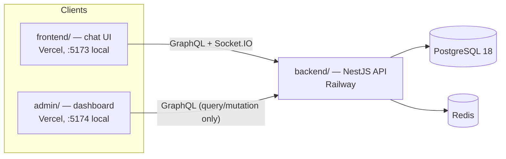
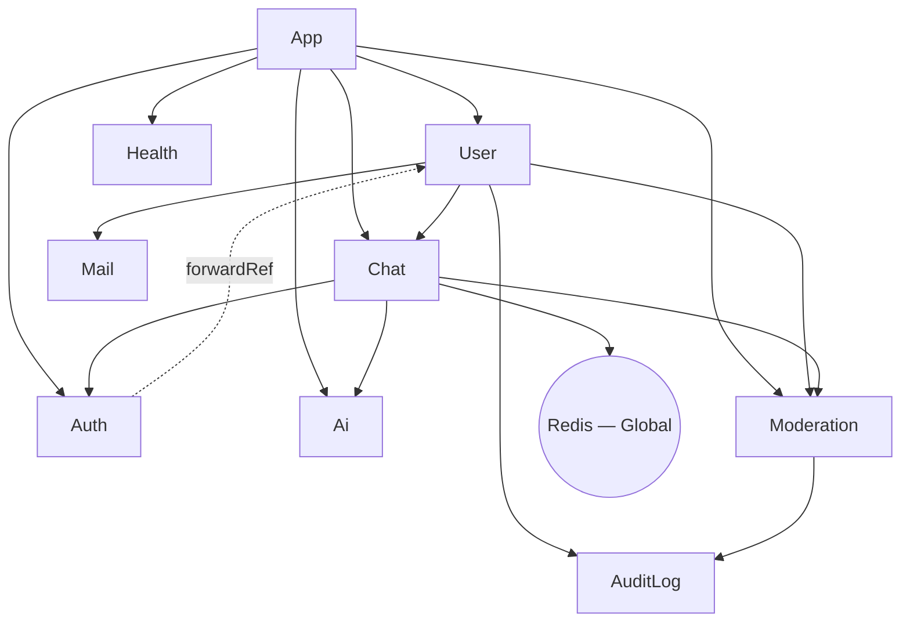
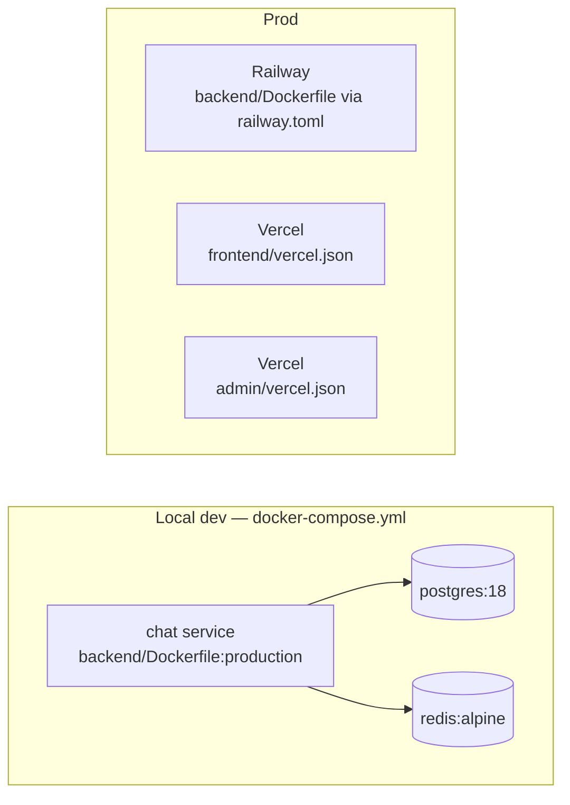

# Architecture

This document is the technical deep-dive companion to [README.md](README.md). README covers the
project pitch, quick start, and feature list; [CLAUDE.md](CLAUDE.md) covers AI-agent conventions and
guardrails. This file covers structure that neither of those fully spells out: the module dependency
graph, guard-chain composition, global bootstrap/error handling, and deployment topology. Where README already documents something well
(project structure tree, entity relationships, the `sendMessage` data flow), this file links to it
instead of restating it, to avoid the two drifting out of sync. Design-intent explanations below are
grounded in code and, where the reasoning isn't derivable from code alone, in the developer's own
stated motivation — never invented.

## System Context

Three deployables share one PostgreSQL database and one Redis instance:

`admin/` has no realtime client (`graphql-ws`/`socket.io-client` are absent from its
`package.json`) — it is a query/mutation-only management surface, not a chat participant.

## Monorepo Layout

pnpm workspace with three packages: `backend/` (NestJS API, the only deployable that talks to
Postgres/Redis), `frontend/` (the chat client), and `admin/` (the management dashboard). See README's
[Project Structure](README.md#project-structure) for the full directory tree.

- **Why:** solo-project scale — one developer maintaining three packages that share a GraphQL contract
  makes monorepo overhead lower than coordinating three separate repos (per the developer: "1인
  프로젝트 규모에 적합하고, 관리가 편리하며, 관리 비용이 적음").

- **Cost:** a single root `pnpm-lock.yaml` couples all three packages' dependency resolution, and CI
  (`.github/workflows/deploy.yml`) doesn't filter by changed path — every push runs both `backend` and
  `admin` lint+test regardless of which package actually changed.

- **Risk:** low at this scale (one developer, three packages); would grow if the team or package count
  grew — the standard mitigation (Nx/Turborepo-style affected-package filtering) isn't in place yet.
Formalized as [ADR 0008](ADR/0008-pnpm-monorepo-layout.md).

## Module Dependency Graph

`backend/src/*/*.module.ts`, verified against each file's `imports`/`exports`:

| Module | Imports | Exports | Notes |
|---|---|---|---|
| `AppModule` | Config, TypeORM, GraphQL, Sentry, `UserModule`, `ChatModule`, `AuthModule`, `AiModule`, `ModerationModule`, `HealthModule` | — | root |
| `UserModule` | `ChatModule`, `AuditLogModule`, `MailModule`, `ModerationModule` | `UserService` | |
| `ChatModule` | `AuthModule`, `RedisModule`, `AiModule`, `ModerationModule` | `ChatService`, `PubSubService` | |
| `AuthModule` | `PassportModule`, `JwtModule`, `forwardRef(() => UserModule)` | `AuthService` | part of a 3-module cycle `Auth → User → Chat → Auth`, broken via `forwardRef` — see [ADR 0017](ADR/0017-auth-user-chat-circular-dependency.md) |
| `AiModule` | TypeORM features only | `AiService`, `AiRoomService` | provides `GENAI_CLIENT` via factory |
| `ModerationModule` | `AuditLogModule` | `ModerationService`, `ModerationGuard` | **never** imports `ChatModule` — see below |
| `AuditLogModule` | TypeORM features only | `AuditLogService` | |
| `MailModule` | — | `MailService` | |
| `RedisModule` | — | `REDIS_CLIENT`, `SessionCacheService` | `@Global()` |
| `HealthModule` | — | — | `HealthController` only, no service/provider deps; liveness endpoint (`/health`) wired to Railway's `healthcheckPath` — see [Deployment Topology](#deployment-topology) |

Trace `User → Chat → Auth → User` in the diagram above to see the 3-module cycle — the `Auth -.
forwardRef .-> User` edge is the only dotted one because it's the sole edge NestJS needs deferred to
boot successfully; the other two edges (`User → Chat`, `Chat → Auth`) are ordinary eager imports that
happen to close the loop. See [ADR 0017](ADR/0017-auth-user-chat-circular-dependency.md).

**Why `ModerationModule` never imports `ChatModule`**: `ChatModule` already depends on
`ModerationModule` (for `ModerationGuard` on `sendMessage`). If `ModerationModule` also depended on
`ChatModule`, that would be a cycle. Instead, `ModerationService` receives chat-side effects
(`publishFn`, `disconnectFn`) as injected callbacks from `ChatResolver` at call time — the same pattern
`AiService.handleReply()` uses. Documented at `backend/src/moderation/moderation.module.ts:1-4`; formalized
as [ADR 0006](ADR/0006-moderation-one-directional-dependency.md).

- **Cost:** `ModerationService`'s methods that need chat effects (e.g. `evaluateMessage`) must accept a
  callback-shaped parameter (`ModerationCallbacks`) instead of a directly injected service — one more
  parameter to thread through call sites, and the coupling is less discoverable than a plain import.

- **Risk:** this codebase already tolerates one circular dependency elsewhere
  (`AuthModule → UserModule → ChatModule → AuthModule`, broken via one `forwardRef`; see
  [ADR 0017](ADR/0017-auth-user-chat-circular-dependency.md)), so the concern here isn't that NestJS
  can't handle a second cycle — `forwardRef` works. It's that a second circular edge would make the module
  graph meaningfully harder to reason about and more fragile to refactor, for no benefit over the
  callback pattern already proven by `AiService`.

**Why `AuditLogModule` sits between `UserModule`/`ModerationModule` and everything else**: privileged actions (role change, force logout, deletion) and automated enforcement (mute, ban, unban) both write through `AuditLogService.log()` as a queryable record independent of the winston log stream — `ModerationService` attributes its automated entries to `getSystemUserId()` rather than a null actor. Formalized as [ADR 0015](ADR/0015-audit-trail-privileged-actions.md).

## Guard Chains

Order is load-bearing in every chain below — each guard depends on state the previous one set on the
request.

| Surface | Chain | Where |
|---|---|---|
| REST (protected) | `JwtAuthGuard` → `RbacGuard` | `user.controller.ts` |
| GraphQL, admin-gated | `GraphQLAuthGuard` → `GraphQLRBACGuard` | `chat.resolver.ts` (comment: "`GraphQLAuthGuard` populates `req.user`; `GraphQLRBACGuard` reads it") |
| GraphQL, `sendMessage` | `GraphQLAuthGuard` → `ModerationGuard` → `RateLimitGuard` | `chat.resolver.ts:186-188` — `ModerationGuard` must gate muted/banned users **before** `RateLimitGuard` spends its velocity budget on them |
| Socket.IO `handleConnection` | JWT parse → `moderationService.isUserBanned()` check | `chat.gateway.ts` — same ban gate `jwt.strategy` applies over HTTP/GraphQL, so a still-valid token can't bypass a ban by connecting over a socket instead |
| GraphQL, `receiveMessage` subscription | `GraphQLAuthGuard` → `isRoomParticipant()` room-membership check | `chat.resolver.ts:309-326` |
| REST, `register`/`signin` | `AuthRateLimitGuard` | `auth.controller.ts:44-45,66-67` — IP-keyed (not userId-keyed, since no user exists pre-auth), 10 attempts/60s via atomic Lua `INCR`+`EXPIRE`, fails closed (denies) on a Redis error — same fail-closed policy as [ADR 0016](ADR/0016-redis-unavailability-policy.md)'s other no-DB-fallback security checks; formalized (alongside the Helmet/CSP split above) as [ADR 0020](ADR/0020-security-headers-and-auth-rate-limit.md) |

**`receiveMessage` runs over `graphql-ws`, not HTTP** — the only guard chain in this table that does.
`GraphQLAuthGuard` reads `ctx.req.headers.authorization`, but a subscription has no HTTP request; the
GraphQL `context()` function (`app.module.ts:106-126`) builds a synthetic `req.headers.authorization`
from `graphql-ws`'s `connectionParams`, captured during `onConnect` and threaded through as `extra`.
This is the actual message-*delivery* guard — `sendMessage`'s guard chain (above) only gates the write
side; every subscriber independently re-proves both authentication and room membership on subscribe,
so a token revoked or a room left after subscribing isn't re-checked mid-stream (the check runs once,
at `receiveMessage` call time, not per delivered message).

**Session-conflict eviction order is deliberate**: `ChatService.registerClient()` (called by `ChatGateway.handleConnection()`) records a new socket as the current session *before* evicting a prior one (`kickPreviousSession()`, `chat.service.ts:57-62`) — recording first avoids a race where the superseded socket's own `disconnect` handler could clobber the new session's online status back to offline. See [ADR 0014](ADR/0014-single-active-session.md).

`ModerationGuard` itself (`moderation.guard.ts`) only checks ban/mute status — it's deliberately thin
(SRP); all strike accrual and enforcement side effects live in `ModerationService`.

- **Cost/Risk of the `sendMessage` order specifically:** `ModerationGuard`'s check is a cheap, mostly
  already-loaded-data check (ban status) plus one Redis `GET` (mute status); `RateLimitGuard`
  (`rate-limit.guard.ts`) executes a Lua script (`INCR` + conditional `EXPIRE`) against Redis. Gating
  on the cheap check first means an already-banned user hammering the endpoint doesn't reach the more
  expensive rate-limit computation. Reversing the order would let a banned user's retry flood spend
  Redis cycles on a request that was always going to be rejected, and could also feed spurious extra
  strikes into `recordVelocityViolation` for an account that's already banned.

## Global Bootstrap Configuration

Cross-cutting request-handling setup registered once in `main.ts`, applying to every route regardless
of module:

- **`app.set('trust proxy', 1)`** (`main.ts:29`) — Railway sits in front as a reverse proxy; without
  this, `req.ip` resolves to the proxy's own address for every request, which would collapse
  `AuthRateLimitGuard`'s per-client IP buckets into one shared bucket (see [Guard
  Chains](#guard-chains)). `1` trusts exactly the immediate hop rather than the full
  `X-Forwarded-For` chain, per the code comment at `main.ts:25-28`.
- **`helmet`** (`main.ts:37`, `app.use(helmet({ contentSecurityPolicy: false }))`) — sets Express's
  standard security-related HTTP response headers. CSP is deliberately left off here: this backend
  serves almost no HTML — REST/GraphQL responses are JSON, so the only page a backend-set CSP header
  would ever apply to is Swagger UI (`/document`) itself, and Swagger's inline bootstrap script would
  need its own CSP exception to keep working. The actual XSS-relevant rendering surface is
  `frontend`/`admin`'s React pages, served from separate Vercel deployments — a CSP header set here has
  no effect there.
- **CSP for `frontend`/`admin`** (`frontend/vercel.json`, `admin/vercel.json`, `headers` block) — set at
  the Vercel edge instead, since that's where the actual rendering surface is. Verified against each
  app's production build before writing directives: neither built `index.html` has an inline
  `<script>` (`script-src 'self'` needs no `'unsafe-inline'`); `frontend` has 6 inline
  `style={{ fontFamily: ... }}` usages in `chat-page.tsx` (static values, not user-derived), so its
  `style-src` includes `'unsafe-inline'` — `admin` has none, so its stays strict; fonts are
  self-hosted (`frontend/public/fonts/*.woff2`), no external font CDN; `img-src` allows `data:` for
  base64 profile images; `connect-src` whitelists the production backend origin over HTTPS (both) and
  WSS (`frontend` only — GraphQL subscriptions + Socket.IO; `admin` has no realtime deps). See
  [ADR 0020](ADR/0020-security-headers-and-auth-rate-limit.md) for the full breakdown of this split,
  including the Helmet side above.
- **`ValidationPipe`** (`main.ts:45-54`) — global, with `whitelist: true` + `forbidNonWhitelisted: true`
  (strips/rejects any property not declared on the target DTO class) and `transform: true` (coerces
  incoming payloads into DTO class instances). This is the enforcement mechanism behind CLAUDE.md's
  Never Do Group 3 "Raw `@Body()` without DTO" rule — validation runs once here for every
  controller/resolver argument typed as a DTO, not re-implemented per endpoint.
- **`app.enableShutdownHooks()`** (`main.ts:23`) — without this, `OnModuleDestroy` hooks
  (`PubSubService`, `SessionCacheService`, `ChatGateway`) never run on `SIGTERM`/`SIGINT`, so every
  deploy would drop Redis connections abruptly instead of closing them gracefully (per the code
  comment at `main.ts:20-22`).
- **Body parser limit raised to 3mb** (`main.ts:42-43`, both `json` and `urlencoded`) — the Express
  default (100kb) is far smaller than a base64-encoded user-uploaded image, per the code comment at
  `main.ts:40-41`. This is what `AllExceptionsFilter`'s payload-too-large → `413` branch (see
  [Error Handling](#error-handling) below) exists to catch when a request exceeds it.

## Error Handling

`AllExceptionsFilter` (`backend/src/base/filter/all-exceptions.filter.ts`) is registered as a single
global filter (`app.useGlobalFilters(new AllExceptionsFilter())`, `main.ts:25`) covering both HTTP and
GraphQL — it branches on `host.getType<'http' | 'ws' | 'graphql'>()` rather than being split into two
filters. Non-`HttpException` errors default to `500`/`INTERNAL_SERVER_ERROR`, except a `body-parser`
"entity.too.large" error, which it detects structurally (not via `instanceof HttpException`, since
`body-parser` throws a plain `Error`) and remaps to `413 PAYLOAD_TOO_LARGE`. In production
(`NODE_ENV === 'production'`), the stack trace is omitted from both the HTTP JSON body and the GraphQL
error's `extensions` — this is the concrete implementation behind CLAUDE.md's Never Do Group 3 "Stack
trace in error response" rule.

- **Sentry capture on `>= 500`** (`all-exceptions.filter.ts:56-58`): the same status check that
  decides `logger.error` vs `logger.warn` also gates a `Sentry.captureException(exception, { extra: {
  stack, isGraphQL } })` call. Optional integration — `instrument.ts` (imported as the literal first
  line of `main.ts`, before `NestFactory`) only calls `Sentry.init()` when `SENTRY_DSN` is set;
  unset, `captureException` is a safe no-op, so local dev/CI need no Sentry account. A `beforeSend`
  hook in `instrument.ts` recursively scrubs `password`/`token`/`secret`-named fields before an event
  leaves the process, since Sentry is third-party SaaS unlike the winston logs. See
  [ADR 0019](ADR/0019-sentry-error-tracking.md) for why manual capture was chosen over Sentry's own
  `@SentryExceptionCaptured()` decorator (its default misses `HttpException`-typed 500s and
  over-reports the intentional 413 branch below).

- **Korean-language user-facing message**: the payload-too-large message
  (`'이미지 용량 크기가 너무 커요!'`) is hardcoded in Korean, unlike the rest of this filter's messages
  and the surrounding codebase/docs (English). Confirmed intentional, not an oversight — written under
  the assumption that the user base is Korean-speaking, and deliberately left as a temporary,
  unextracted string pending future work: adding an English translation for English-speaking users (per
  the developer). See CLAUDE.md's [Internationalization (i18n)](CLAUDE.md#internationalization-i18n)
  section — this string is exactly the kind of inlined UI text that section flags for extraction once an
  i18n library is adopted.

## Data Flow

The `sendMessage` GraphQL mutation path and the Socket.IO connection lifecycle are both already
diagrammed step-by-step in README's [Flow](README.md#flow) section — read that for the authoritative
walkthrough (transaction boundary, post-commit AI reply trigger, Redis Pub/Sub delivery); the
transaction-boundary decision itself is formalized in [ADR 0003](ADR/0003-database-transaction-strategy.md).
The one addition relevant here: `ModerationService.evaluateMessage()` runs inside that same path, between guard
checks and persistence, and can itself trigger a system-message publish (warn/mute/ban notices) through
the identical `receiveMessage :${roomId}` channel — see [AI Reply Channel Parity](CLAUDE.md#chat--caching)
in CLAUDE.md, which this reuses rather than introducing a second delivery path. The post-commit AI
reply trigger (`AiService.handleReply()`) acquires a per-room Redis lock before generating a reply —
see [ADR 0007](ADR/0007-ai-reply-distributed-lock.md) for why a skip-not-queue lock at room granularity
was chosen over alternatives.

- **Risk:** `evaluateMessage()` runs in a `setImmediate` block that fires *after* `pubSub.publish()`
  has already delivered the triggering message to subscribers (`chat.resolver.ts:206` publishes before
  the moderation block starts). The offending message itself is never blocked pre-delivery — only
  messages sent *after* a mute/ban takes effect are prevented. This is a deliberate latency tradeoff
  (moderation evaluation adds no round-trip time to `sendMessage`), not an oversight, but it does mean
  moderation here is reactive-after-delivery, not preventive-before-delivery, for the message that
  triggers a strike.

## Deployment Topology

- **Local**: `docker compose up -d --build` — three services (`chat`, `postgres:18`, `redis:alpine`),
  all ports bound to `127.0.0.1` only (a prior incident exposed these to `0.0.0.0`; see README's
  [AI-Assisted Development Notes](README.md#ai-assisted-development-notes)). `chat` runs
  `pnpm migration:run && node dist/main` on start, same as production.

  - **Risk if this were reverted:** the exact incident already documented — an exposed dev port on a
    machine with a public IP led to a ransomware bot wiping the dev database.

  - **Cost of keeping it:** reaching the dev server from another device on the LAN (e.g. testing from
    a phone) needs an SSH tunnel or explicit port-forward instead of a bare IP:port — a real but small
    inconvenience traded for closing a proven attack path.

See [ADR 0013](ADR/0013-local-dev-network-binding.md) for the full breakdown.

- **Backend / Railway**: `railway.toml` builds `backend/Dockerfile` (multi-stage), runs the same
  migrate-then-start command, restarts on failure up to 3 times, and polls `healthcheckPath = "/health"`
  (`HealthModule`'s liveness endpoint, `healthcheckTimeout = 30`) to know when the new container is
  actually up before cutting over. Deploy is triggered by
  `.github/workflows/deploy.yml`'s `deploy` job on push to `main` only, and that job now requires
  `test` and `e2e` to succeed first (`needs: [test, e2e]`) — both changed from non-blocking
  (`continue-on-error: true`, no effect on `deploy`) to blocking during this documentation pass, since
  no reason for the original non-blocking setup was on record.

  - **`admin-e2e` is deliberately left non-blocking until proven stable**: gating `deploy` on a job
    with no confirmed successful run in the real CI environment risks blocking a legitimate deploy on an
    untested pipeline detail (service container timing, the superadmin seed script, etc.) rather than an
    actual code problem — local YAML/unit-test validation alone doesn't confirm a job actually completes
    in GitHub Actions. Before adding `admin-e2e` back to `deploy`'s `needs`, check this workflow's
    Actions run history and confirm it has completed successfully at least once; `e2e` was confirmed the
    same way before being made blocking. See [CONTRIBUTING.md](CONTRIBUTING.md#before-submitting-a-pr)
    for the full CI job table.

- **Frontend & Admin / Vercel**: two separate Vercel projects, each with its own `vercel.json` (SPA
  rewrite only) and its own `CORS_ORIGIN` entry on the backend (see CLAUDE.md's
  [CORS](CLAUDE.md#cors) section — the env var is a comma-separated list covering both origins).
  Why `admin` is a separate app in the first place (rather than a protected route in
  `frontend`) is formalized as [ADR 0009](ADR/0009-admin-separate-app.md).

- **Why Railway + Vercel**: free/low-cost tiers sufficient for a personal project, plus convenient
  GitHub-push-to-deploy integration on both platforms.

  - **Cost/Risk:** two separate platforms means split observability — logs and metrics live in two
    different dashboards instead of one. (Railway-side log durability specifically -- a narrower, single-platform concern -- is addressed separately in [ADR 0018](ADR/0018-railway-volume-log-persistence.md). Backend error tracking is a third dashboard, Sentry, added on top of this split -- see [ADR 0019](ADR/0019-sentry-error-tracking.md).) Running `frontend`/`admin` as two separate Vercel projects
    (rather than one) doubles the CORS surface to maintain (`CORS_ORIGIN` must list both origins,
    everywhere it's set) — accepted because the two apps need genuinely independent deploy cadences
    (see [ADR 0005](ADR/0005-cors-multi-origin-policy.md)).

See [ADR 0010](ADR/0010-railway-vercel-deployment.md) for the full breakdown of the Railway + Vercel
choice.

- **Durable logs via an attached Railway Volume**: Railway's container filesystem is ephemeral —
  every redeploy wiped `error.logs.log`, making it useless for post-incident investigation.
  `logger.ts` now reads `RAILWAY_VOLUME_MOUNT_PATH` (auto-injected once a volume is attached) and
  falls back to the local `./logs` dir when unset, so behavior off Railway is unchanged. Railway has
  no config-as-code representation for volumes, so the volume itself is provisioned out-of-band
  (dashboard/CLI) — a fresh environment that skips this step silently falls back to ephemeral logs
  rather than failing loudly. See [ADR 0018](ADR/0018-railway-volume-log-persistence.md).

- **Node/pnpm pin**: `.nvmrc` = `24`; `packageManager: pnpm@10.33.0`, both enforced in CI.

## Tech Stack

Verified against each package's actual `dependencies` (not `devDependencies`) — kept current with
`package.json`. README's [Stacks](README.md#stacks) section covers the original rationale for these
choices; below, each major architectural choice also carries its accepted cost/risk, which README's
Stacks section doesn't state.

- **backend**: NestJS 11 (`common`/`core`/`config`/`graphql`/`jwt`/`passport`/`platform-express`/
  `platform-socket.io`/`swagger`/`typeorm`/`websockets`), `@apollo/server` 5, `@google/genai`,
  `@socket.io/redis-adapter`, `@sentry/nestjs`, `bcrypt`, `class-validator`/`class-transformer`,
  `graphql` 16, `graphql-redis-subscriptions`, `ioredis`, `joi`, `nest-winston`/`winston`, `nodemailer`,
  `passport-jwt`, `pg`, `socket.io`/`socket.io-client`, `typeorm` 0.3, `cookie-parser`, `dotenv`.

- **frontend**: React 19, `@apollo/client` 4, `graphql-ws`, `socket.io-client`, `axios`, `dompurify`,
  `react-hook-form`, `react-router-dom` 7, `zustand`, `jwt-decode`.

- **admin**: React 19, `@apollo/client` 4, `axios`, `react-hook-form`, `react-router-dom` 7, `zustand`,
  `jwt-decode` — no `graphql-ws`/`socket.io-client` (query/mutation-only, no realtime subscription).

### Major choices — cost/risk

- **NestJS as the backend framework**

  - **Risk realized:** `@nestjs/cli`'s build step couldn't create a symlink against pnpm's
    symlink-based `node_modules` layout on Alpine Linux inside Docker, breaking the test build
    entirely — debugged and fixed in `backend/Dockerfile` (2026-05-29). Not a hypothetical
    compatibility concern; this is a real toolchain interaction that already broke a build in this
    repo.

- **Socket.IO (connection lifecycle) + GraphQL (messaging)**

  - **Cost:** every new message-delivery use case must go through the single existing
    `PubSubService.publish()` channel rather than adding a parallel path — this split itself took ~5
    months to fully land (see [ROADMAP's Build Timeline](ROADMAP.md#build-timeline-2026-01--2026-07)).

  - **Risk:** Redis Pub/Sub delivers at-most-once — a subscriber disconnected at publish time misses
    the message permanently. See [ADR 0004](ADR/0004-graphql-socketio-api-layer-split.md) for the
    full breakdown.

- **PostgreSQL + TypeORM**

  - **Cost:** `migration:generate` has a known quirk in this repo — it re-emits a spurious FK
    drop/re-add on the participants join table that must be manually stripped from every generated
    migration (see CLAUDE.md's Database section).

  - **Risk:** forgetting that step breaks `ON DELETE CASCADE` for user deletion, silently, until
    someone tries to delete a user.

- **Redis via ioredis**

  - **Three separate client instances**, not one shared connection: `REDIS_CLIENT` (`redis.module.ts`,
    backs `SessionCacheService`), and `pubClient`/`subClient` (`chat.gateway.ts`'s `afterInit`, backing
    `@socket.io/redis-adapter`) — plus whatever `graphql-redis-subscriptions` opens internally for
    `PubSubService` (see CLAUDE.md's Cache section: "pub/sub uses a dedicated subscriber connection").
    `redis.module.ts` and `chat.gateway.ts` each independently parse `REDIS_URL` and detect `rediss:`
    for TLS — the connection-config logic (host/port/password/TLS extraction) is duplicated verbatim
    between the two files rather than shared.

  - **Cost:** every new cache/session key must follow the `{service}:{entity}:{id}` naming convention
    and carry an explicit TTL — a small but mandatory extra step at every call site that touches
    Redis.

  - **Risk:** skipping the TTL risks unbounded memory growth (see
    [Resolved Anomaly](#resolved-anomaly) for a related case), and running a second Redis client
    alongside `ioredis` creates ambiguity about which one is authoritative — which had, in fact,
    already happened by accident before this pass. See [ADR 0002](ADR/0002-redis-cache-conventions.md)
    for the full breakdown.

  - **Unavailability policy:** three call sites (JWT blacklist check, `user_cache` read/write, mute
    check) previously had no error handling at all — an unexpected Redis failure propagated uncaught
    into an undocumented `500`, inconsistent with `RateLimitGuard`'s deliberate fail-closed handling.
    Fixed and formalized as [ADR 0016](ADR/0016-redis-unavailability-policy.md): security checks with
    no DB fallback fail closed explicitly; `user_cache` (which already has a DB fallback in the same
    method) degrades to a cache-miss instead.

- **Google Gemini (AI)**

  - **Cost:** per-token billing means unbounded prompt size or retries translate directly into cost —
    mitigated by the token/history/retry caps already in place (`ai.service.ts`).

  - **Risk:** a third-party API outage or rate-limit means AI replies silently stop; already handled
    as a caught, logged skip rather than a crash, so the failure mode is "no AI reply," not "broken
    chat."

  See [ADR 0011](ADR/0011-gemini-ai-provider.md) for the full breakdown, including why Gemini rather
  than another provider.

- **JWT + Passport (auth)**

  - **Cost:** every client needing a fresh `accessToken` must route through the shared
    `refreshAccessTokenSafely()` function instead of calling the refresh endpoint directly — an extra
    layer of indirection every new call site has to know about.

  - **Risk:** storing `accessToken` anywhere other than memory (e.g. `localStorage`), or bypassing the
    shared refresh function, reopens the XSS/CSRF exposure and refresh-race conditions this design was
    built to close. See [ADR 0001](ADR/0001-jwt-auth-token-strategy.md) for the full breakdown.

## Entities

See README's [Entities](README.md#entities-typeorm) section for the full field-level breakdown
(`UserEntity`, `ChatEntity`, `RoomEntity`, `AiRoomEntity`, `EntityBase`) — kept current there, no need
to duplicate it here.

- **Risk of this delegation**: this is a single point of failure by construction — if README's Entities
  section drifts from the actual entity files (it already had, once: a stale `RoomEntity.aiPersonality`
  field survived here until this documentation pass caught it against `room.entity.ts`), this section's
  "kept current there" claim becomes silently false with no local signal. The same applies to every
  other `file:line` citation across this document and the ADR/ suite — none of them are mechanically
  checked against source, so accuracy depends entirely on the last person who happened to re-verify by
  hand.

**`AiRoomEntity` split from `RoomEntity`**: a room's active AI personality was originally a nullable
`aiPersonality` column directly on `RoomEntity`; migration `ExtractAiPersonalityToAiRoomEntity`
(`1749639600000`) moved it into a separate `AiRoomEntity` (`OneToOne` back to `RoomEntity`,
`onDelete: 'CASCADE'`).

- **Why:** separation of concerns between AI-specific room state and general room state, and cleaner
  ongoing management of that data (per the developer).

Formalized as [ADR 0012](ADR/0012-airoomentity-split.md).

## Resolved Anomaly

`backend/package.json`'s `dependencies` previously included `redis` (v5 — an unused second Redis
client; `ioredis` is the only one actually imported anywhere in `backend/src`), plus `audit`, `lint`,
and `pnpm` as literal installed packages with no import site anywhere in the codebase — all four read
as accidental `pnpm add` mistakes. Confirmed unused and removed.

- **Risk that made this worth fixing rather than leaving flagged:** an unused-but-installed `redis`
  client sitting alongside `ioredis` is exactly the kind of ambiguity that leads a future contributor
  (or an AI assistant) to import the wrong one, plus every installed package — used or not — is attack
  surface that `pnpm audit`/Dependabot will flag and someone has to triage. `audit`/`lint`/`pnpm` as
  literal packages added no functionality at all, only lockfile bloat and confusion about whether they
  were load-bearing.

## Related Documents

- [README.md](README.md) — pitch, quick start, features, full data-flow walkthrough
- [CLAUDE.md](CLAUDE.md) — AI-agent conventions, Never Do rules, architecture decisions
- [CONTRIBUTING.md](CONTRIBUTING.md) — local setup, branch/commit conventions, PR checklist
- [ADR/](ADR/) — formal records of decisions from CLAUDE.md's Architecture Decisions and
  Project-Specific Principles sections
- [ROADMAP.md](ROADMAP.md) — planned future work
- [CHANGELOG.md](CHANGELOG.md) — full commit history
