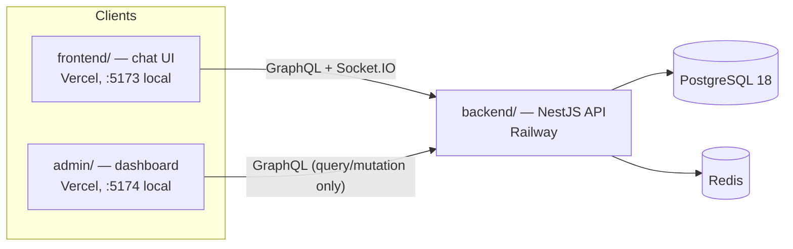
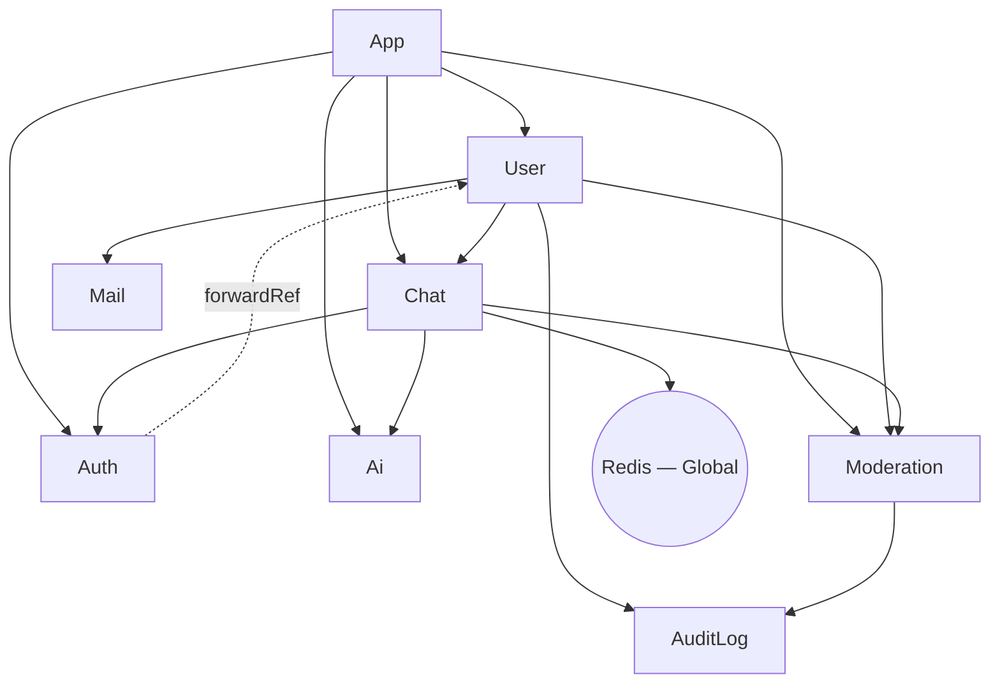
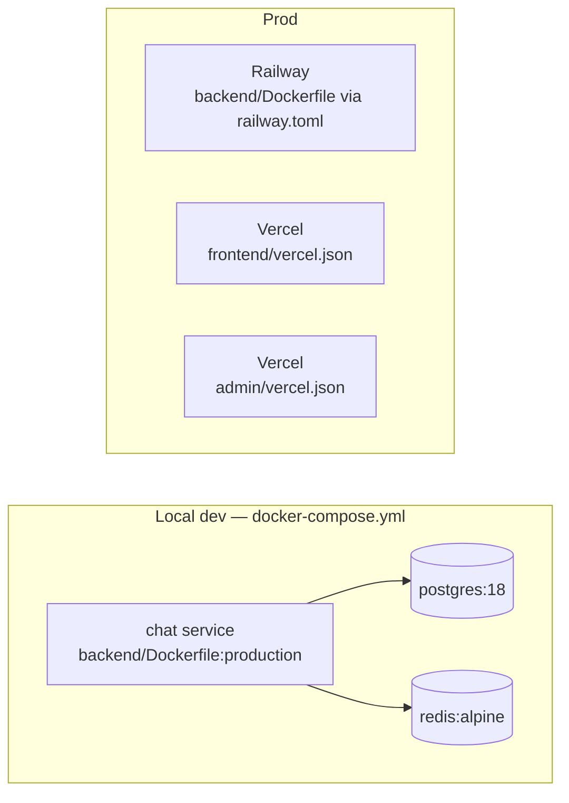

# Architecture

This document is the technical deep-dive companion to [README.md](README.md). README covers the
project pitch, quick start, and feature list; [CLAUDE.md](CLAUDE.md) covers AI-agent conventions and
guardrails. This file covers structure that neither of those fully spells out: the module dependency
graph, guard-chain composition, and deployment topology. Where README already documents something well
(project structure tree, entity relationships, the `sendMessage` data flow), this file links to it
instead of restating it, to avoid the two drifting out of sync.

## System Context

Three deployables share one PostgreSQL database and one Redis instance:

`admin/` has no realtime client (`graphql-ws`/`socket.io-client` are absent from its
`package.json`) — it is a query/mutation-only management surface, not a chat participant.

## Monorepo Layout

pnpm workspace with three packages: `backend/` (NestJS API, the only deployable that talks to
Postgres/Redis), `frontend/` (the chat client), and `admin/` (the management dashboard). See README's
[Project Structure](README.md#project-structure) for the full directory tree.

## Module Dependency Graph

`backend/src/*/*.module.ts`, verified against each file's `imports`/`exports`:

| Module | Imports | Exports | Notes |
|---|---|---|---|
| `AppModule` | Config, TypeORM, GraphQL, `UserModule`, `ChatModule`, `AuthModule`, `AiModule`, `ModerationModule` | — | root |
| `UserModule` | `ChatModule`, `AuditLogModule`, `MailModule`, `ModerationModule` | `UserService` | |
| `ChatModule` | `AuthModule`, `RedisModule`, `AiModule`, `ModerationModule` | `ChatService`, `PubSubService` | |
| `AuthModule` | `PassportModule`, `JwtModule`, `forwardRef(() => UserModule)` | `AuthService` | circular dep with `UserModule`, broken via `forwardRef` |
| `AiModule` | TypeORM features only | `AiService`, `AiRoomService` | provides `GENAI_CLIENT` via factory |
| `ModerationModule` | `AuditLogModule` | `ModerationService`, `ModerationGuard` | **never** imports `ChatModule` — see below |
| `AuditLogModule` | TypeORM features only | `AuditLogService` | |
| `MailModule` | — | `MailService` | |
| `RedisModule` | — | `REDIS_CLIENT`, `SessionCacheService` | `@Global()` |

**Why `ModerationModule` never imports `ChatModule`**: `ChatModule` already depends on
`ModerationModule` (for `ModerationGuard` on `sendMessage`). If `ModerationModule` also depended on
`ChatModule`, that would be a cycle. Instead, `ModerationService` receives chat-side effects
(`publishFn`, `disconnectFn`) as injected callbacks from `ChatResolver` at call time — the same pattern
`AiService.handleReply()` uses. Documented at `backend/src/moderation/moderation.module.ts:1-4`.

## Guard Chains

Order is load-bearing in every chain below — each guard depends on state the previous one set on the
request.

| Surface | Chain | Where |
|---|---|---|
| REST (protected) | `JwtAuthGuard` → `RbacGuard` | `user.controller.ts` |
| GraphQL, admin-gated | `GraphQLAuthGuard` → `GraphQLRBACGuard` | `chat.resolver.ts` (comment: "`GraphQLAuthGuard` populates `req.user`; `GraphQLRBACGuard` reads it") |
| GraphQL, `sendMessage` | `GraphQLAuthGuard` → `ModerationGuard` → `RateLimitGuard` | `chat.resolver.ts:186-188` — `ModerationGuard` must gate muted/banned users **before** `RateLimitGuard` spends its velocity budget on them |
| Socket.IO `handleConnection` | JWT parse → `moderationService.isUserBanned()` check | `chat.gateway.ts` — same ban gate `jwt.strategy` applies over HTTP/GraphQL, so a still-valid token can't bypass a ban by connecting over a socket instead |

`ModerationGuard` itself (`moderation.guard.ts`) only checks ban/mute status — it's deliberately thin
(SRP); all strike accrual and enforcement side effects live in `ModerationService`.

## Data Flow

The `sendMessage` GraphQL mutation path and the Socket.IO connection lifecycle are both already
diagrammed step-by-step in README's [Flow](README.md#flow) section — read that for the authoritative
walkthrough (transaction boundary, post-commit AI reply trigger, Redis Pub/Sub delivery). The one
addition relevant here: `ModerationService.evaluateMessage()` runs inside that same path, between guard
checks and persistence, and can itself trigger a system-message publish (warn/mute/ban notices) through
the identical `receiveMessage :${roomId}` channel — see [AI Reply Channel Parity](CLAUDE.md#chat--caching)
in CLAUDE.md, which this reuses rather than introducing a second delivery path.

## Deployment Topology

- **Local**: `docker compose up -d --build` — three services (`chat`, `postgres:18`, `redis:alpine`),
  all ports bound to `127.0.0.1` only (a prior incident exposed these to `0.0.0.0`; see README's
  [AI-Assisted Development Notes](README.md#ai-assisted-development-notes)). `chat` runs
  `pnpm migration:run && node dist/main` on start, same as production.
- **Backend / Railway**: `railway.toml` builds `backend/Dockerfile` (multi-stage), runs the same
  migrate-then-start command, restarts on failure up to 3 times. Deploy is triggered by
  `.github/workflows/deploy.yml`'s `deploy` job on push to `main` only.
- **Frontend & Admin / Vercel**: two separate Vercel projects, each with its own `vercel.json` (SPA
  rewrite only) and its own `CORS_ORIGIN` entry on the backend (see CLAUDE.md's
  [CORS](CLAUDE.md#cors) section — the env var is a comma-separated list covering both origins).
- **Node/pnpm pin**: `.nvmrc` = `24`; `packageManager: pnpm@10.33.0`, both enforced in CI.

## Tech Stack

Verified against each package's actual `dependencies` (not `devDependencies`) — README's
[Stacks](README.md#stacks) section covers the *why* behind these choices; this is the *what*, kept
current with `package.json`.

- **backend**: NestJS 11 (`common`/`core`/`config`/`graphql`/`jwt`/`passport`/`platform-express`/
  `platform-socket.io`/`swagger`/`typeorm`/`websockets`), `@apollo/server` 5, `@google/genai`,
  `@socket.io/redis-adapter`, `bcrypt`, `class-validator`/`class-transformer`, `graphql` 16,
  `graphql-redis-subscriptions`, `ioredis`, `joi`, `nest-winston`/`winston`, `nodemailer`,
  `passport-jwt`, `pg`, `socket.io`/`socket.io-client`, `typeorm` 0.3, `cookie-parser`, `dotenv`.
- **frontend**: React 19, `@apollo/client` 4, `graphql-ws`, `socket.io-client`, `axios`, `dompurify`,
  `react-hook-form`, `react-router-dom` 7, `zustand`, `jwt-decode`.
- **admin**: React 19, `@apollo/client` 4, `axios`, `react-hook-form`, `react-router-dom` 7, `zustand`,
  `jwt-decode` — no `graphql-ws`/`socket.io-client` (query/mutation-only, no realtime subscription).

## Entities

See README's [Entities](README.md#entities-typeorm) section for the full field-level breakdown
(`UserEntity`, `ChatEntity`, `RoomEntity`, `EntityBase`) — it's accurate and current, no need to
duplicate it here.

## Resolved Anomaly

`backend/package.json`'s `dependencies` previously included `redis` (v5 — an unused second Redis
client; `ioredis` is the only one actually imported anywhere in `backend/src`), plus `audit`, `lint`,
and `pnpm` as literal installed packages with no import site anywhere in the codebase — all four read
as accidental `pnpm add` mistakes. Confirmed unused and removed.

## Related Documents

- [README.md](README.md) — pitch, quick start, features, full data-flow walkthrough
- [CLAUDE.md](CLAUDE.md) — AI-agent conventions, Never Do rules, architecture decisions
- [CONTRIBUTING.md](CONTRIBUTING.md) — local setup, branch/commit conventions, PR checklist
- [ADR/](ADR/) — formal records of decisions from CLAUDE.md's Architecture Decisions and
  Project-Specific Principles sections
- [ROADMAP.md](ROADMAP.md) — planned future work
- [CHANGELOG.md](CHANGELOG.md) — full commit history
