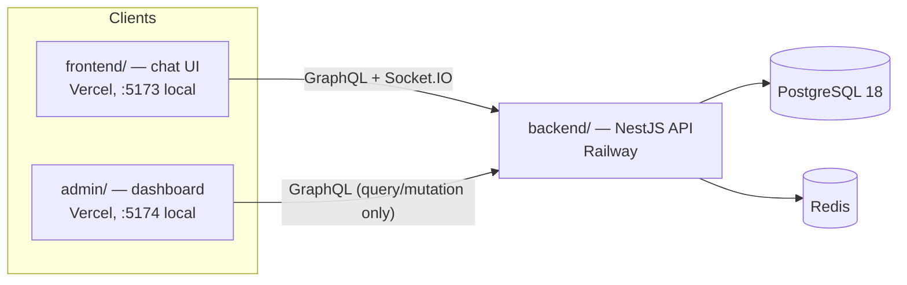
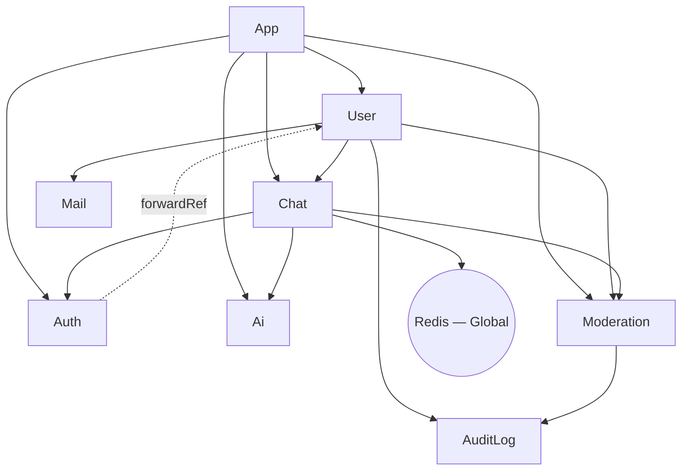
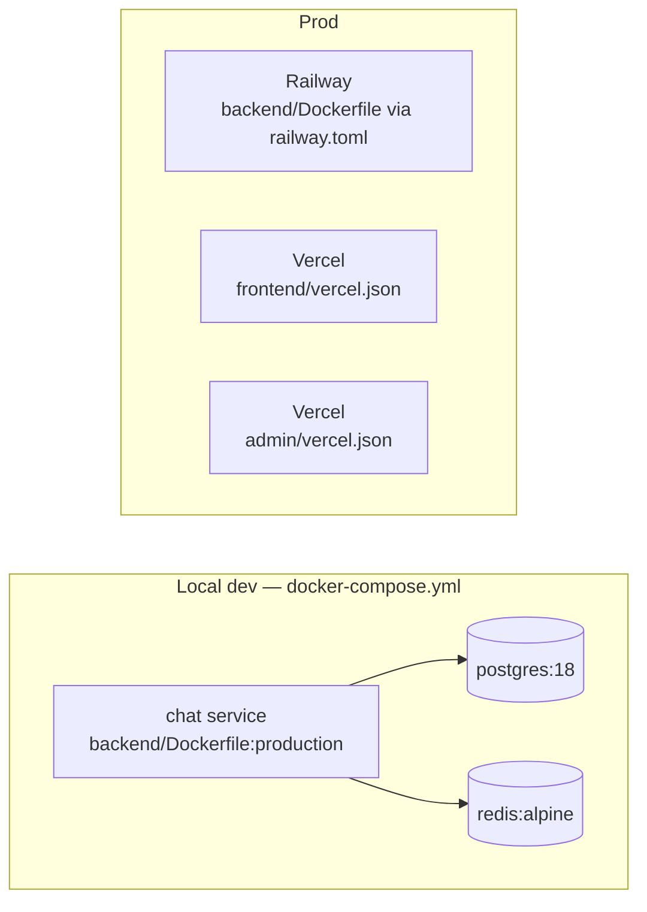

# Architecture

This document is the technical deep-dive companion to [README.md](README.md). README covers the
project pitch, quick start, and feature list; [CLAUDE.md](CLAUDE.md) covers AI-agent conventions and
guardrails. This file covers structure that neither of those fully spells out: the module dependency
graph, guard-chain composition, and deployment topology. Where README already documents something well
(project structure tree, entity relationships, the `sendMessage` data flow), this file links to it
instead of restating it, to avoid the two drifting out of sync. Design-intent explanations below are
grounded in code and, where the reasoning isn't derivable from code alone, in the developer's own
stated motivation — never invented.

## System Context

Three deployables share one PostgreSQL database and one Redis instance:

`admin/` has no realtime client (`graphql-ws`/`socket.io-client` are absent from its
`package.json`) — it is a query/mutation-only management surface, not a chat participant.
*Cost:* one fewer dependency, simpler auth surface — no WS handshake/reconnect logic to maintain.
*Risk:* if a future feature needs live moderation alerts in the admin panel, this boundary needs
retrofitting a subscription client rather than extending an existing one.

## Monorepo Layout

pnpm workspace with three packages: `backend/` (NestJS API, the only deployable that talks to
Postgres/Redis), `frontend/` (the chat client), and `admin/` (the management dashboard). See README's
[Project Structure](README.md#project-structure) for the full directory tree.

*Why:* solo-project scale — one developer maintaining three packages that share a GraphQL contract
makes monorepo overhead lower than coordinating three separate repos (per the developer: "1인 프로젝트
규모에 적합하고, 관리가 편리하며, 관리 비용이 적음").
*Cost:* a single root `pnpm-lock.yaml` couples all three packages' dependency resolution, and CI
(`.github/workflows/deploy.yml`) doesn't filter by changed path — every push runs both `backend` and
`admin` lint+test regardless of which package actually changed.
*Risk:* low at this scale (one developer, three packages); would grow if the team or package count
grew — the standard mitigation (Nx/Turborepo-style affected-package filtering) isn't in place yet.

## Module Dependency Graph

`backend/src/*/*.module.ts`, verified against each file's `imports`/`exports`:

| Module | Imports | Exports | Notes |
|---|---|---|---|
| `AppModule` | Config, TypeORM, GraphQL, `UserModule`, `ChatModule`, `AuthModule`, `AiModule`, `ModerationModule` | — | root |
| `UserModule` | `ChatModule`, `AuditLogModule`, `MailModule`, `ModerationModule` | `UserService` | |
| `ChatModule` | `AuthModule`, `RedisModule`, `AiModule`, `ModerationModule` | `ChatService`, `PubSubService` | |
| `AuthModule` | `PassportModule`, `JwtModule`, `forwardRef(() => UserModule)` | `AuthService` | circular dep with `UserModule`, broken via `forwardRef` |
| `AiModule` | TypeORM features only | `AiService`, `AiRoomService` | provides `GENAI_CLIENT` via factory |
| `ModerationModule` | `AuditLogModule` | `ModerationService`, `ModerationGuard` | **never** imports `ChatModule` — see below |
| `AuditLogModule` | TypeORM features only | `AuditLogService` | |
| `MailModule` | — | `MailService` | |
| `RedisModule` | — | `REDIS_CLIENT`, `SessionCacheService` | `@Global()` — *cost/risk:* any provider can inject `REDIS_CLIENT` without explicitly importing `RedisModule`, which is convenient but makes the true dependency graph less visible from imports alone |

**Why `ModerationModule` never imports `ChatModule`**: `ChatModule` already depends on
`ModerationModule` (for `ModerationGuard` on `sendMessage`). If `ModerationModule` also depended on
`ChatModule`, that would be a cycle. Instead, `ModerationService` receives chat-side effects
(`publishFn`, `disconnectFn`) as injected callbacks from `ChatResolver` at call time — the same pattern
`AiService.handleReply()` uses. Documented at `backend/src/moderation/moderation.module.ts:1-4`.

*Cost:* `ModerationService`'s methods that need chat effects (e.g. `evaluateMessage`) must accept a
callback-shaped parameter (`ModerationCallbacks`) instead of a directly injected service — one more
parameter to thread through call sites, and the coupling is less discoverable than a plain import.
*Risk:* this codebase already tolerates one circular dependency elsewhere (`AuthModule` ↔ `UserModule`
via `forwardRef`, see the table above), so the concern here isn't that NestJS can't handle a second
cycle — `forwardRef` works. It's that a second circular edge would make the module graph meaningfully
harder to reason about and more fragile to refactor, for no benefit over the callback pattern already
proven by `AiService`.

**`AuthModule` ↔ `UserModule` (existing `forwardRef` cycle)**: unlike the `ModerationModule` case
above, this cycle *was* accepted. *Cost:* `forwardRef`-wrapped providers depend on NestJS resolving
both modules' providers before either is fully usable — a subtler initialization-order dependency than
a plain import. *Risk:* if a provider inside this cycle tried to use the other module's service inside
its own constructor (rather than only in methods called after bootstrap), it could hit an
not-yet-initialized value; this hasn't happened here, but it's the class of bug `forwardRef` cycles are
prone to.

## Guard Chains

Order is load-bearing in every chain below — each guard depends on state the previous one set on the
request.

| Surface | Chain | Where |
|---|---|---|
| REST (protected) | `JwtAuthGuard` → `RbacGuard` | `user.controller.ts` |
| GraphQL, admin-gated | `GraphQLAuthGuard` → `GraphQLRBACGuard` | `chat.resolver.ts` (comment: "`GraphQLAuthGuard` populates `req.user`; `GraphQLRBACGuard` reads it") |
| GraphQL, `sendMessage` | `GraphQLAuthGuard` → `ModerationGuard` → `RateLimitGuard` | `chat.resolver.ts:186-188` — `ModerationGuard` must gate muted/banned users **before** `RateLimitGuard` spends its velocity budget on them |
| Socket.IO `handleConnection` | JWT parse → `moderationService.isUserBanned()` check | `chat.gateway.ts` — same ban gate `jwt.strategy` applies over HTTP/GraphQL, so a still-valid token can't bypass a ban by connecting over a socket instead |

`ModerationGuard` itself (`moderation.guard.ts`) only checks ban/mute status — it's deliberately thin
(SRP); all strike accrual and enforcement side effects live in `ModerationService`.

*Cost/Risk of the `sendMessage` order specifically:* `ModerationGuard`'s check is a cheap, mostly
already-loaded-data check (ban status) plus one Redis `GET` (mute status); `RateLimitGuard`
(`rate-limit.guard.ts`) executes a Lua script (`INCR` + conditional `EXPIRE`) against Redis. Gating on
the cheap check first means an already-banned user hammering the endpoint doesn't reach the more
expensive rate-limit computation. Reversing the order would let a banned user's retry flood spend Redis
cycles on a request that was always going to be rejected, and could also feed spurious extra strikes
into `recordVelocityViolation` for an account that's already banned.

## Data Flow

The `sendMessage` GraphQL mutation path and the Socket.IO connection lifecycle are both already
diagrammed step-by-step in README's [Flow](README.md#flow) section — read that for the authoritative
walkthrough (transaction boundary, post-commit AI reply trigger, Redis Pub/Sub delivery). The one
addition relevant here: `ModerationService.evaluateMessage()` runs inside that same path, between guard
checks and persistence, and can itself trigger a system-message publish (warn/mute/ban notices) through
the identical `receiveMessage :${roomId}` channel — see [AI Reply Channel Parity](CLAUDE.md#chat--caching)
in CLAUDE.md, which this reuses rather than introducing a second delivery path.

*Risk:* `evaluateMessage()` runs in a `setImmediate` block that fires *after* `pubSub.publish()` has
already delivered the triggering message to subscribers (`chat.resolver.ts:206` publishes before the
moderation block starts). The offending message itself is never blocked pre-delivery — only messages
sent *after* a mute/ban takes effect are prevented. This is a deliberate latency tradeoff (moderation
evaluation adds no round-trip time to `sendMessage`), not an oversight, but it does mean moderation here
is reactive-after-delivery, not preventive-before-delivery, for the message that triggers a strike.

## Deployment Topology

- **Local**: `docker compose up -d --build` — three services (`chat`, `postgres:18`, `redis:alpine`),
  all ports bound to `127.0.0.1` only (a prior incident exposed these to `0.0.0.0`; see README's
  [AI-Assisted Development Notes](README.md#ai-assisted-development-notes)). `chat` runs
  `pnpm migration:run && node dist/main` on start, same as production.
  *Risk if this were reverted:* the exact incident already documented — an exposed dev port on a
  machine with a public IP led to a ransomware bot wiping the dev database. *Cost of keeping it:*
  reaching the dev server from another device on the LAN (e.g. testing from a phone) needs an SSH
  tunnel or explicit port-forward instead of a bare IP:port — a real but small inconvenience traded for
  closing a proven attack path.
- **Backend / Railway**: `railway.toml` builds `backend/Dockerfile` (multi-stage), runs the same
  migrate-then-start command, restarts on failure up to 3 times. Deploy is triggered by
  `.github/workflows/deploy.yml`'s `deploy` job on push to `main` only.
- **Frontend & Admin / Vercel**: two separate Vercel projects, each with its own `vercel.json` (SPA
  rewrite only) and its own `CORS_ORIGIN` entry on the backend (see CLAUDE.md's
  [CORS](CLAUDE.md#cors) section — the env var is a comma-separated list covering both origins).
- **Why Railway + Vercel**: free/low-cost tiers sufficient for a personal project, plus convenient
  GitHub-push-to-deploy integration on both platforms.
  *Cost/Risk:* two separate platforms means split observability — logs and metrics live in two
  different dashboards instead of one. Running `frontend`/`admin` as two separate Vercel projects
  (rather than one) doubles the CORS surface to maintain (`CORS_ORIGIN` must list both origins,
  everywhere it's set) — accepted because the two apps need genuinely independent deploy cadences (see
  [ADR 0005](ADR/0005-cors-multi-origin-policy.md)).
- **Node/pnpm pin**: `.nvmrc` = `24`; `packageManager: pnpm@10.33.0`, both enforced in CI.

## Tech Stack

Verified against each package's actual `dependencies` (not `devDependencies`) — kept current with
`package.json`. README's [Stacks](README.md#stacks) section covers the original rationale for these
choices; below, each major architectural choice also carries its accepted cost/risk, which README's
Stacks section doesn't state.

- **backend**: NestJS 11 (`common`/`core`/`config`/`graphql`/`jwt`/`passport`/`platform-express`/
  `platform-socket.io`/`swagger`/`typeorm`/`websockets`), `@apollo/server` 5, `@google/genai`,
  `@socket.io/redis-adapter`, `bcrypt`, `class-validator`/`class-transformer`, `graphql` 16,
  `graphql-redis-subscriptions`, `ioredis`, `joi`, `nest-winston`/`winston`, `nodemailer`,
  `passport-jwt`, `pg`, `socket.io`/`socket.io-client`, `typeorm` 0.3, `cookie-parser`, `dotenv`.
- **frontend**: React 19, `@apollo/client` 4, `graphql-ws`, `socket.io-client`, `axios`, `dompurify`,
  `react-hook-form`, `react-router-dom` 7, `zustand`, `jwt-decode`.
- **admin**: React 19, `@apollo/client` 4, `axios`, `react-hook-form`, `react-router-dom` 7, `zustand`,
  `jwt-decode` — no `graphql-ws`/`socket.io-client` (query/mutation-only, no realtime subscription).

### Major choices — cost/risk

- **NestJS as the backend framework**: *Cost:* more structure/boilerplate (modules, DI, decorators)
  than a minimal Express app, and a steeper initial learning curve. *Risk:* GraphQL/TypeORM integration
  goes through Nest's own wrapper packages (`@nestjs/graphql`, `@nestjs/typeorm`) rather than those
  libraries directly, tying upgrade timing to Nest's own release cadence for those wrappers.
- **Monolith, single deployable**: *Cost:* the chat, auth, AI, and moderation concerns all scale
  together — the AI service can't be scaled independently from the chat service under load. *Risk:*
  low at this project's actual traffic; would become a real constraint only if one concern's resource
  needs diverged sharply from the others (e.g. AI calls needing far more memory/CPU than chat traffic).
- **Socket.IO (connection lifecycle) + GraphQL (messaging)**: cost/risk already covered in
  [ADR 0004](ADR/0004-graphql-socketio-api-layer-split.md)'s Consequences section.
- **PostgreSQL + TypeORM**: *Cost:* `migration:generate` has a known quirk in this repo — it re-emits a
  spurious FK drop/re-add on the participants join table that must be manually stripped from every
  generated migration (see CLAUDE.md's Database section). *Risk:* forgetting that step breaks
  `ON DELETE CASCADE` for user deletion, silently, until someone tries to delete a user.
- **Redis via ioredis**: cost/risk already covered in
  [ADR 0002](ADR/0002-redis-cache-conventions.md)'s Consequences section.
- **Google Gemini (AI)**: *Cost:* per-token billing means unbounded prompt size or retries translate
  directly into cost — mitigated by the token/history/retry caps already in place
  (`ai.service.ts`). *Risk:* a third-party API outage or rate-limit means AI replies silently stop;
  already handled as a caught, logged skip rather than a crash, so the failure mode is "no AI reply,"
  not "broken chat."
- **JWT + Passport (auth)**: cost/risk already covered in
  [ADR 0001](ADR/0001-jwt-auth-token-strategy.md)'s Consequences section.

## Entities

See README's [Entities](README.md#entities-typeorm) section for the full field-level breakdown
(`UserEntity`, `ChatEntity`, `RoomEntity`, `EntityBase`) — it's accurate and current, no need to
duplicate it here.

## Resolved Anomaly

`backend/package.json`'s `dependencies` previously included `redis` (v5 — an unused second Redis
client; `ioredis` is the only one actually imported anywhere in `backend/src`), plus `audit`, `lint`,
and `pnpm` as literal installed packages with no import site anywhere in the codebase — all four read
as accidental `pnpm add` mistakes. Confirmed unused and removed.

*Risk that made this worth fixing rather than leaving flagged:* an unused-but-installed `redis` client
sitting alongside `ioredis` is exactly the kind of ambiguity that leads a future contributor (or an AI
assistant) to import the wrong one, plus every installed package — used or not — is attack surface that
`pnpm audit`/Dependabot will flag and someone has to triage. `audit`/`lint`/`pnpm` as literal packages
added no functionality at all, only lockfile bloat and confusion about whether they were load-bearing.

## Related Documents

- [README.md](README.md) — pitch, quick start, features, full data-flow walkthrough
- [CLAUDE.md](CLAUDE.md) — AI-agent conventions, Never Do rules, architecture decisions
- [CONTRIBUTING.md](CONTRIBUTING.md) — local setup, branch/commit conventions, PR checklist
- [ADR/](ADR/) — formal records of decisions from CLAUDE.md's Architecture Decisions and
  Project-Specific Principles sections
- [ROADMAP.md](ROADMAP.md) — planned future work
- [CHANGELOG.md](CHANGELOG.md) — full commit history
