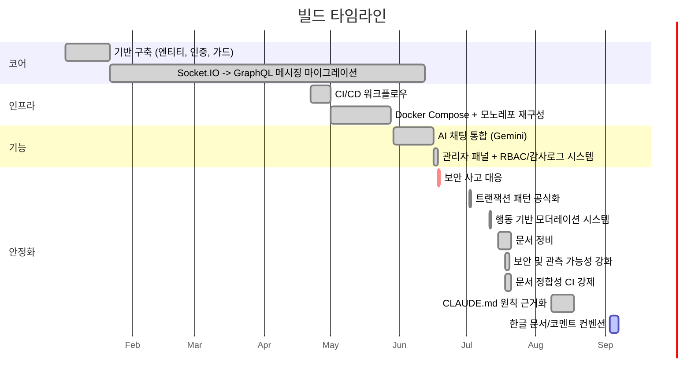

# 로드맵

## 빌드 타임라인 (2026-01 ~ 2026-09)

이 프로젝트가 실제로 어떤 과정을 거쳐 지금에 이르렀는지를, 기억이 아니라 `git log`를 근거로
재구성한 단계임. 날짜는 각 단계를 대표하는 커밋이 들어간 시점임. 여러 단계가 깔끔하게
순차적으로 끝나지 않고 서로 겹침(특히 Socket.IO→GraphQL 마이그레이션은 완전히 정착되기까지
약 5개월이 걸림). 커밋 단위 전체 기록은 [CHANGELOG.md](CHANGELOG.md)를 참고하세요.

1. **기반 구축** (2026-01-02 ~ 2026-01-21) — 첫 커밋: "Built user, auth, chat entities, relations,
   guard, interceptors, etc." 기본 JWT 인증, TypeORM 엔티티, 초기 Socket.IO 채팅 프로토타입.
   *이유:* README의 [Project Motivation](README.ko.md#프로젝트-동기)에 따르면, 다른 것을 그 위에
   쌓기 전에 인증/인가(Basic/Bearer/JWT, RBAC 가드)를 end-to-end로 연습하기 위함.

2. **Socket.IO → GraphQL 메시징 마이그레이션** (2026-01-22 ~ 2026-06-11) — 가장 오래 걸린
   단계이며, 한 번의 깔끔한 전환이 아님. GraphQL 메시지 전달 테스트는 2026-01-22에
   시작함("Testing Socket through GraphQL real time responses"). `sendMessage`의 초기
   트랜잭션 구현은 2026-03-01에 들어갔고, 기존 Socket.IO 메시지 핸들러는 2026-06-11에야 실제로
   삭제됨("unused WS sendMessage handler and Socket.IO broadcast removed"). 즉 두 경로가
   약 4.5개월간 공존하다가 그제서야 GraphQL이 유일한 메시지 전달 경로가 된 것임.
   [ADR 0004](ADR/0004-graphql-socketio-api-layer-split.md) 참고.
   *이유:* 메시지 영속화에 트랜잭션 보장을 확보하기 위함. Project Motivation의 표현을 빌리면
   "이런 변경이 실제 운영 중인 시스템에서 이론이 아니라 실제로 얼마나 비용이 드는지 배우기 위해."

3. **배포 인프라** (2026-04-22 ~ 2026-05-27) — CI/CD 워크플로우는 2026-04-22에, Docker Compose는
   2026-05-01에 추가됨. 이어진 모노레포 재구성(2026-05-13 ~ 2026-05-27)을 거쳐 지금의
   `backend/`/`frontend/` 워크스페이스 패키지 구조로 정리됨.
   *이유:* Project Motivation의 "기능 데모에서 멈추지 않는다"는 원칙대로, 실제로 배포되는
   서비스에 필요한 CI/CD와 컨테이너화된 로컬 개발환경을 나중이 아니라 처음부터 갖춤.

4. **AI 채팅 통합** (2026-05-29 ~) — Gemini 기반 AI 동반자(`AiService`). 첫 등장 커밋은
   "Update: AI Chat Bot for registered users."
   *이유:* README의 Project Motivation에 명시되어 있지 않음. 가장 가까운 문서화된 근거는 비용
   상한 설계(토큰 제한, 대화 이력 절단, 재시도 상한) 자체뿐이고, "애초에 왜 AI 채팅을
   추가했는지"는 근거가 없으므로 추측하지 않고 공백으로 남겨둠.

5. **관리자 패널 + RBAC/감사로그 시스템** (2026-06-16 ~ 2026-06-17) — `admin/` 워크스페이스
   패키지, superadmin 역할 계층, 감사로그 시스템이 이틀 사이에 연달아 들어옴.
   *이유:* 배포 인프라와 같은 "데모가 아니다" 동기. 실사용자·방 관리와 감사 추적은 있으면 좋은
   기능이 아니라, 실제 다중 사용자 서비스라면 반드시 필요한 것.

6. **보안 사고 대응** (2026-06-18) — "Fix: password leak via missing serializer, stale role cache,
   RBAC bypass on audit log, admin signout method, and bind local dev server to loopback." 전체
   경위는 README의 [AI-Assisted Development Notes](README.ko.md#ai-보조-개발-사례) 참고.
   *이유:* 계획된 작업이 아니었음. 실제 사고(노출된 개발 포트로 랜섬웨어 봇이 개발 DB를 삭제)가
   발생했고, 조용히 덮지 않고 봉쇄와 자격증명 교체까지 끝까지 처리한 뒤 문서화함.

7. **트랜잭션 패턴 공식화** (2026-07-02) — 그때까지 `sendMessage`를 처리하던 인라인
   `dataSource.transaction()` 호출을 대체하며 `GqlTransactionInterceptor`가 도입됨.
   [ADR 0003](ADR/0003-database-transaction-strategy.md) 참고.
   *이유:* ADR 0003의 Context에 따르면, 여러 테이블에 걸친 쓰기가 공유 `QueryRunner` 없이
   이루어지면 실패 시 부분 쓰기가 데이터를 고아 상태로 남김. open/commit/rollback/release를
   인터셉터 하나로 중앙화하면 이를 유발한 그 사례 하나만이 아니라, 앞으로의 모든 다중 쓰기
   뮤테이션에서 이 문제가 막힘.

8. **행동 기반 모더레이션 시스템** (2026-07-11) — 스트라이크 누적 + 에스컬레이션 사다리
   (경고 → 뮤트 → 기간제 밴 → 영구 밴). [ADR 0006](ADR/0006-moderation-one-directional-dependency.md) 참고.
   *이유:* 관리자 패널·배포 인프라와 같은 "데모가 아니다" 동기. 실사용자끼리 감독 없이 메시지를
   주고받을 수 있게 되면 실제로 필요해지는 악용 방지.

9. **문서 정비** (2026-07-15 ~ 2026-07-20) — README 전면 개정, 이어서 이
   ARCHITECTURE/CONTRIBUTING/ROADMAP/CHANGELOG 문서 세트 작업, 그리고 CLAUDE.md의 원래 5개
   결정에서 21개까지 늘어난 ADR 세트(각각 한국어 `.ko.md` 쌍 포함). 2026-07-20 이후로 계속되는
   문서 수정은 이 단계의 연장이 아니라, 11번 단계가 강제하는 유지보수로 간주함.
   *이유:* 프로젝트가 README 파일 하나 수준을 넘어 커지는 동안, 컨벤션과 아키텍처 결정이 코드
   주석과 CLAUDE.md 한 파일에 암묵적으로 흩어져 쌓여 있었음. CLAUDE.md 자체의
   공백(`ModerationModule`, `admin/` 워크스페이스 언급 누락 등)도 이 문서 세트를 만드는 과정에서
   드러났고, 방치하지 않고 함께 고침.

10. **보안 및 관측 가능성 강화** (2026-07-18 ~ 2026-07-19) — Helmet 보안 헤더와 `trust proxy`,
    `signin`/`register`에 대한 IP 기준 레이트리밋
    ([ADR 0020](ADR/0020-security-headers-and-auth-rate-limit.md) 참고), `frontend`/`admin` CSP,
    의존성 취약점 23건(high 5건) 패치, Railway healthcheck에 연결된 liveness `/health` 엔드포인트,
    재배포 간 로그 영속화([ADR 0018](ADR/0018-railway-volume-log-persistence.md)),
    Sentry 에러 트래킹([ADR 0019](ADR/0019-sentry-error-tracking.md)), Dependabot.
    *이유:* ADR 0019의 Context에 따르면 메트릭·트레이싱·에러 그룹화가 모노레포 전체에 부재했음.
    ADR 0018이 로그의 영속성은 확보했지만, Railway 볼륨 위의 `error.logs.log`는 결국 누군가가
    "가서 봐야 한다"는 사실을 기억하고 있어야만 의미가 있음. 2026-06-18 사고는 봉쇄에는
    성공했지만, 그 시점의 구성에는 다음 사고를 묻기 전에 먼저 알려주는 장치가 없었음. 범위는
    의도적으로 좁혀 백엔드 에러 트래킹만 진행했고, `frontend`/`admin` 에러 트래킹은 별도 작업으로
    미뤄둔 상태.

11. **문서 정합성 CI 강제** (2026-07-18 ~) — `pnpm check:adr`(끊긴 링크/앵커, 오래된 라인 인용,
    인접 심볼 내용 일치, `.ko.md` 쌍 누락, EN/KO 제목 구조 parity), `pnpm check:config`
    (`MODERATION_DEFAULTS`가 문서화된 4개 미러에서 동기화되어 있는지), `pnpm check:deps`
    (README의 의존성 목록과 `backend/package.json` 일치), `pnpm check:changelog`(모든 커밋이
    영·한 양쪽 CHANGELOG에 1:1로 기록되어 있는지) — 전부 차단(blocking) `test` 잡에 배선.
    *이유:* 9번 단계의 문서 세트는 전반에 걸쳐 구체적인 `file:line` 위치를 인용하는데, 작성된 지
    며칠 만에 이미 낡아버린 것들이 있었음(`5759009`은 CLAUDE.md 자체의 그런 인용 4건을 고침).
    산문으로 적힌 관례는 움직이는 코드베이스를 견디지 못함. 정확성 주장을 기계 검사 대상으로
    만들지 않으면 조용히 썩고, 그것은 애초에 인용이 없는 것보다 나쁨.

12. **CLAUDE.md 원칙 근거화** (2026-08-08 ~ 2026-08-17) — CLAUDE.md Engineering Principles
    섹션의 모든 항목(SOLID, DIP/IoC, OCP, LSP, Unix Philosophy, Design by Contract, Safe
    Defaults, Avoid Premature Optimization, Robustness Principle, Defensive Programming 등)을
    이 코드베이스에 이미 있는 구체적인 사례에 연결하거나, 채택하지 않았다고 명시적으로
    표시함. 미해결로 남아있던 Principle Conflict Protocol 사례 2건도 함께 정리함. 그 외:
    `NODE_ENV`에서 `RUNTIME_ENV`를 분리함([ADR 0022](ADR/0022-node-env-runtime-env-split.ko.md))
    — `envFilePath`/호스트 바인딩 판단에 필요한 "docker-compose 내부"와 "그냥 `pnpm
    start:dev`"를 `NODE_ENV` 하나로는 구분할 수 없었음.
    *이유:* 근거 사례 없이 이름만 나열된 원칙은, 11번 단계가 코드 인용에 대해 잡으려던 것과
    똑같은 종류의 검증 불가능한 주장임. "SOLID"나 "Design by Contract"라는 이름을 되풀이하는
    것만으로는 프로젝트 고유 컨벤션이 되지 않음 — 이 코드베이스의 무엇이 실제로 그 원칙을
    따르는지, 혹은 왜 따르지 않는지를 가리켜야 함.

13. **한글 문서/코멘트 컨벤션** (2026-09-03 ~ 2026-09-06) — CLAUDE.md에 Writing Style 섹션이
    추가되어, 코드 코멘트와 커밋 메시지를 한글로, `-습니다`체나 AI 어투 필러가 아니라 terse한
    명사형(`-함/임/음`)으로 쓰도록 정함. 모노레포 전체에 적용함 — 모든 backend
    서비스/가드/DTO/엔티티, frontend와 admin 소스, 유닛테스트 spec, Playwright e2e 스위트,
    빌드/인프라 스크립트(`scripts/*.mjs`, GitHub Actions, Dockerfile, docker-compose),
    `.env.example` 파일까지. 실제 WHY를 담은 코멘트는 번역하고, 순수 WHAT 설명/필러는
    제거함(단, 죽은 코드나 이미 정정된 실수를 설명하던 코멘트는 복원 대상에서 제외). `.ko.md`
    문서 28개도 같은 terse 문체로 전환함. `CHANGELOG.md`/`.ko.md`는 `check:changelog`가
    잡아낸 미기록 커밋 26건을 채워넣음. 이 단계의 코멘트 줄 수 변화로 ADR/CLAUDE.md/
    ARCHITECTURE.md의 `file:line` 인용 여러 곳이 밀렸는데, `check:adr`의 심볼 매칭으로는
    자동으로 못 잡는 것들이라 전수 수동 재대조로 찾아 고침.
    *이유:* 1인 개발 프로젝트이고 개발자가 한국어 화자이며 앱 UI도 이미 한글임. 코드
    코멘트가 영어로 (그것도 초기 개발 단계의 튜토리얼식 보일러플레이트가 많이 남은 채로)
    기본값인 것은 UI 언어와도, CLAUDE.md의 나머지 부분이 이미 요구하던 terse WHY 전용
    기준과도 맞지 않았음.

## 예정 (Planned)

README의 옛 "향후 확장 계획" 절에서 옮겨온 백로그임. 확정된 타임라인이나 우선순위가
아님.

### 백엔드

- 대화 목록의 마지막 메시지 + 읽지 않은 메시지 수 — 목록 자체는 이미 있음
  (`getMyRooms`, `chat.service.ts`). 다만 `{ roomId, recipientId }`만 반환하므로, 없는 것은
  "목록"이 아니라 마지막 메시지 미리보기와 읽지 않은 수임. 범위는 아직 미확정. 참여자별
  "마지막으로 읽은 시각"을 저장하는 방향이 유력하지만, 정확한 스키마(기존 participants
  조인테이블에 컬럼 추가 vs 별도 read-receipt 테이블)는 아직 열려 있음.
- 그룹 채팅방 (`roomId`로 여러 참여자에게 브로드캐스트) — `RoomEntity.participants`가 이미
  `@ManyToMany`라서 데이터 모델은 지원하지만, `findRoom`/`getRoom`/`createRoom`(`chat.service.ts`)이
  현재 정확히 2명 기준으로 하드코딩되어 있어 단순 확장이 아니라 재설계가 필요함. `getMyRooms`는
  더 눈에 안 띄는 네 번째 호출부: 상대를 `participants.find(p => p.id !== userId)`로 고르기
  때문에, 3인 이상 방에서는 실패하는 대신 임의의 참여자 한 명을 반환하게 됨. 현재 방향: 방을
  만든 사람(방장)만 새 참여자를 초대할 수 있음(오픈 초대 모델 아님).
- 방/대화 이력 삭제 기능 — 관리자 전용 `deleteRoom` 뮤테이션은 이미 존재하지만
  (`chat.resolver.ts`, `@RBAC(UserRole.admin)`) 전체 참여자 기준 hard delete이고, 사용자용 경로는
  없음. 사용자용 기능의 현재 방향: 방장이 삭제하면 전체 참여자에게 삭제로 표시되고, 방장이
  아닌 참여자가 삭제하면 그 사람만 방에서 나가는 방식(방 자체는 나머지 참여자에게 유지). 이때
  함께 결정할 미결 사항: 기존 관리자 hard delete를 같은 soft-delete 방식으로 수렴시킬지, 별개
  동작으로 남길지. 구체적인 구현(스키마, cascade 동작)은 아직 미설계.
- "입력 중" 표시기 — 방향: [ADR 0004](ADR/0004-graphql-socketio-api-layer-split.md)의 "Socket.IO는
  채팅 트래픽을 나르지 않는다" 원칙을 지키기 위해, Socket.IO에 추가하지 않고 `receiveMessage`와
  같은 GraphQL Subscription 채널로 구현.
- `ping`/`getAiUserId`/`getSystemUserId` 인증·레이트리밋 — 2026-09-16 결정됨.
  `getAiUserId`/`getSystemUserId`에는 `getAiPersonalityInfo`와 동일한 패턴으로
  `@UseGuards(GraphQLAuthGuard, QueryRateLimitGuard)`를 추가함(`chat.resolver.ts`). 호출부를
  추적한 결과 `frontend/src/pages/chat-page.tsx`는 `ProtectedRoute` 뒤에서만 이 둘을 호출하고
  `admin/`은 아예 호출하지 않아, 기존의 무가드 상태에 의존하는 비인증 흐름이 없었음을 확인함.
  `ping`은 의도적으로 그대로 둠 — README.md에 무인증 헬스체크로 문서화되어 있고, REST
  `/health` liveness 엔드포인트(`health.controller.ts`)의 기존 무가드 패턴과 동일한 의도이며,
  DB/Redis/연산 비용이 전혀 없어 노출 정도가 그 엔드포인트와 같음. 참고: 설령 원했더라도
  `QueryRateLimitGuard`만 `ping`에 붙이는 건 불가능함 — `req.user.id`가 없으면 401을 던지므로
  (`query-rate-limit.guard.ts:33-37`), 무인증 쿼리와 짝지으려면 이 범위 밖인 새 IP 기반
  리미터가 필요함.
- `receiveMessage` 구독에 `QueryRateLimitGuard`(또는 동등한 가드) 적용 — 다른 모든 인증된
  GraphQL 엔드포인트에는 이제 레이트리밋 가드(`QueryRateLimitGuard` 또는 `RateLimitGuard`)가
  있지만 이것만 없음. `canActivate`가 구독 시점에 한 번만 실행되므로 붙여도 재구독 시도만
  제한될 뿐 메시지 수신량 자체는 못 막음 — 그것만으로 추가할 가치가 있는지는 아직 미정.

### 프론트엔드

- 채팅방 목록의 읽지 않은 메시지 수 배지 — 목록 UI 자체는 이미 `getMyRooms` 기반으로 렌더링되고
  있음(`chat-page.tsx`). 없는 것은 읽지 않음 배지뿐이며, 위 백엔드 항목에 종속.

### 코드 품질/일관성 백로그 (2026-09 감사)

전체 앱의 의존성/일관성을 훑은 조사(2026-09-14/15)에서 나온 항목들 — 파일별 실제 호출 체인을
추적하고, 헤더 코멘트를 실제 소비처와 대조하고, 생성된 산출물(`schema.gql`)을 소스와 대조함. 실제
런타임/보안 영향이 있던 5건(유저 삭제 시 `user_cache` 미삭제, `data-source.ts`의 마이그레이션용
`DataSource`에서 엔티티 누락, `sendMessage`의 unhandled rejection 경로, `frontend`의 CI lint/test
게이트 누락, admin 로그인 시 cross-tab 세션 마커 미기록)는 같은 주에 수정됨 — `CHANGELOG.md`의
`851f765`~`d0ad00a` 부근 참고. 아래는 나머지 — 실재하지만 영향이 낮아 즉시 고치지 않고 백로그로
남긴 것들. 애초에 "교차 모듈 확인 필요"로 남겼던 2건(admin의 `AdminRoomType`/`RoomInfoType` 필드
사용과 `schema.gql` 대조, `getAllRooms`/`deleteRoom`/`getOnlineUser`/`getUserNicknames` 리졸버
가드 수준과 admin이 실제로 요구하는 권한 대조)은 재확인 결과 문제없음 — 여기엔 안 실음.

**백엔드**
- `auth/guard/rbac.guard.ts`의 `accessLevel` 맵(`:37,44`)은 이미 자기 자신과 같은 값을 갖는
  `UserRole` 숫자 enum 위에 항등 매핑을 또 만든 것 — `GraphQLRBACGuard`는 맵 없이
  `user.role ?? UserRole.user >= role`로 동일 로직을 직접 처리함. 맵을 걷어내고 직접 비교로
  통일할 것.
- `moderation/constants/moderation.constants.ts`의 헤더(`:3`)는 `moderation.guard.ts`를 소비처로
  명시하는데, 가드는 설계상(SRP — 임계값 로직은 서비스에만) 이 파일을 import 안 함. 실제 두 번째
  소비처인 `user.service.ts`의 `SYSTEM_USER_EMAIL` import는 헤더에 빠져있음.
- `user/user.service.ts`의 `create()`(`:50`)를 호출하는 컨트롤러 라우트가 없음 — 회원가입은
  `AuthService.register()`가 이메일/닉네임 중복확인+bcrypt+save 로직을 독자적으로 중복 구현함.
  의도된 호출자(admin용 유저 생성 엔드포인트?)를 확인하거나 제거할 것.
- `user.service.ts`의 `remove()`는 고아 방 정리 전에 삭제된 유저가 속했던 방 개수만큼 `COUNT`
  쿼리를 반복함(N+1 형태). 1:1 채팅 앱이라 유저당 방 수가 적어 긴급도는 낮음.
- `graphql/base.type.ts`의 `BaseType`(`:3-8`, `created`/`updated`)은 `UserType`이 상속하지만
  생성된 `schema.gql`엔 반영 안 됨 — code-first 생성이 왜 이 필드를 누락하는지 먼저 원인을 찾은
  뒤 생성 쪽을 고칠지 죽은 필드를 지울지 결정할 것.
- `auth/dto/token-types.auth.dto.ts`의 `tokenType`(`:11`)은 저장소 전체에 소비처 없음 — 형제
  항목인 `bearerTokenType`만 실사용됨.
- `ai/enums/ai-personality.enum.ts`의 `AI_PERSONALITY_LABELS`(`:12`)는 소비처 없음 —
  `frontend/`가 personality 라벨을 이 상수를 안 쓰고 독자적으로 하드코딩 중.
- `mail/mail.service.ts`(`:28-29`)가 `SMTP_PORT`를 인접한 두 줄에서 각각 `ConfigService`로
  재조회해 `port`/`secure`를 도출함.

**프론트엔드**
- `api/apollo.ts`의 `errorLink`(`:17-30`)는 silent 토큰 refresh 실패 시
  `observer.error`/`observer.complete`를 호출하지 않고 그냥 return함 — Observable(및 이를
  기다리던 query/mutation)이 완결되지 않고 남을 수 있음. 구조가 동일한 `admin/src/api/apollo.ts`의
  `errorLink`는 같은 분기에서 `observer.error(error)`를 호출함 — `frontend/` 쪽을 맞출 것.
- `pages/chat-page.tsx`의 `handlePersonalitySelect`(`:441-446`)는 mutation에 `onError`도,
  `await` 주변 try/catch도 없음 — 사용자에게 보이는 mutation 실패는 노출이 필수라는 이 파일
  자체의 컨벤션 위반.
- 동일한 인라인 API 에러 타입 캐스팅 `(err as { response?: { data?: { message?: ... } } })`이
  `account-page.tsx`(`:79,112`), `register-page.tsx`(`:35`), `signin-page.tsx`(`:48,50`) 3개
  파일에 5번 손으로 반복됨 — `axios.isAxiosError()`를 안 씀. `getApiErrorMessage(err)` 헬퍼
  하나로 추출할 것.
- `App.tsx:12-13`에 `<Route path='/'>`가 두 개 선언되어 있음 — 두 번째(플레이스홀더
  `
Login Page
`)는 영원히 도달 불가능하고, `:17`에 동일 문구의 주석 잔재도 남아있음.
  둘 다 치우지 않은 스캐폴드 흔적.
- `useAuthStore()`가 5곳(`account-page.tsx:18`, `chat-page.tsx:84-85`, `signin-page.tsx:17`,
  `protected-route.tsx:7`)에서 셀렉터 없이 호출되어, 각 컴포넌트가 읽는 필드가 아니라 스토어
  전체를 구독함.
- `main.tsx:8`의 `document.getElementById('root')!`는 non-null assertion(Never Do Group 1) —
  `index.html`이 해당 엘리먼트를 보장해서 실질 위험은 낮지만 명시적으로 좁혀두는 게 원칙에 맞음.
- `package.json:35`의 `@testing-library/user-event` devDependency는 `frontend/src` 어디서도
  import된 곳이 없음.
- `pages/chat-page.tsx`의 `signOut`(`:525-530`)은 본문이 코멘트뿐인 빈 catch — 의도(이미 만료된
  토큰이어도 best-effort 로그아웃)는 정당하나 형태는 금지된 빈 catch 패턴과 문자 그대로 일치.

**Admin**
- `signOut` 핸들러 4개(`dashboard-page.tsx`, `logs-page.tsx`, `rooms-page.tsx`, `users-page.tsx`)
  전부 `clearTokens()`만 호출하고 `clearSessionUser()`는 호출 안 함 — 같은 탭에서 로그아웃 후
  다른 관리자로 재로그인하면 남은 세션 마커 때문에 다음 silent refresh가 정상 로그인을 cross-tab
  충돌로 오판할 수 있음.
- `admin/e2e/users.spec.ts`에 `demoteSuperadmin`(`users-page.tsx`) 케이스가 없음 — 가장 최근
  추가된 권한 액션이자, CLAUDE.md의 Compromised Superadmin Containment 기준 탈취된 superadmin
  계정을 복구하는 유일한 인앱 경로.
- `actionColor`/`ACTION_COLOR` 액션→배지색 매핑이 `dashboard-page.tsx:69`, `logs-page.tsx:121`,
  `users-page.tsx:43` 3곳에서 각각 다르게 구현됨(두 곳은 if/else 체인, 한 곳은 `Record`) — 4개
  페이지에 걸쳐 nav/signOut JSX도 공용 컴포넌트 없이 중복됨.
- `admin/e2e/seed-superadmin.mjs:36`이 `HASH_ROUNDS`(CI에선 12)를 안 읽고
  `bcrypt.hash(password, 10)`을 하드코딩함 — 휘발성 CI 픽스처 DB라 실위험은 낮지만
  single-source-of-truth env 컨벤션과 조용히 어긋남.

**문서**
- CLAUDE.md의 CI/CD 섹션이 `test` job 단계를 `check:deps`까지만 나열하고 `check:changelog`는
  빠뜨림 — 실제로는 `deploy.yml:46`이 같은 job에서 이 스텝을 돌림.

### 개발 환경 도구

- OS 수준 샌드박스(`.claude/settings.local.json`의 `sandbox.enabled`) — 2026-09-16 검토, 미도입
  결정함. 공식 Claude Code 문서 확인 결과 네이티브 Windows에서는 샌드박스가 동작하지 않음
  (bubblewrap은 Linux/WSL2 전용, Seatbelt는 macOS 전용) — 이 개발 환경은 Windows 10 네이티브임.
  이 환경이 WSL2로 이전되면 재검토. 그때까지는 `.claude/settings.local.json`의 명령어 패턴 기반
  `deny`/`allow`/`ask` 규칙이 유일한 집행 계층임 — 알려진 한계: Bash/PowerShell 규칙 매칭은
  명령어 문자열/접두사 기준이라 의미 기반이 아니므로, 다르게 인용부호를 쓰거나 별칭을 쓴 명령은
  특정 `deny` 항목을 피해갈 수 있음. `defaultMode: "default"`가 실질 노출 범위를 `allow` 목록에
  있는 것으로 한정함 — 그 외는 전부 매번 확인을 거치기 때문.

## 관련 문서

- [README.md](README.md) — 현재 기능 집합
- [ARCHITECTURE.md](ARCHITECTURE.md) — 이 항목들이 확장하게 될 시스템 구조
- [CHANGELOG.md](CHANGELOG.md) — 커밋 단위 전체 기록
