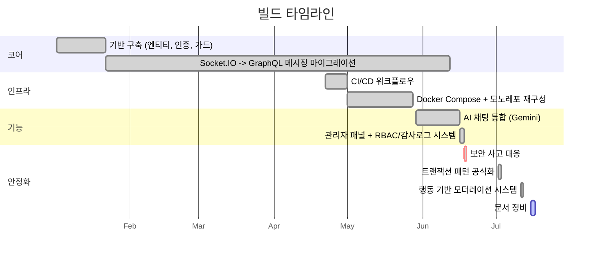

# 로드맵

## 빌드 타임라인 (2026-01 ~ 2026-07)

이 프로젝트가 실제로 어떻게 지금 여기까지 왔는지 — 기억이 아니라 `git log`(커밋 573개)를 근거로
재구성한 단계입니다. 날짜는 각 단계를 대표하는 커밋이 들어간 시점이며, 여러 단계가 깔끔하게
순차적으로 끝나지 않고 서로 겹칩니다(특히 Socket.IO→GraphQL 마이그레이션은 완전히 정착되기까지
약 5개월이 걸렸습니다). 커밋 단위 전체 기록은 [CHANGELOG.md](CHANGELOG.md) 참고.

1. **기반 구축** (2026-01-02 ~ 2026-01-21) — 첫 커밋: "Built user, auth, chat entities, relations,
   guard, interceptors, etc." 기본 JWT 인증, TypeORM 엔티티, 초기 Socket.IO 채팅 프로토타입.

2. **Socket.IO → GraphQL 메시징 마이그레이션** (2026-01-22 ~ 2026-06-11) — 가장 오래 걸린 단계이며
   깔끔한 한 번의 전환이 아니었습니다. GraphQL 메시지 전달 테스트는 2026-01-22에 시작("Testing
   Socket through GraphQL real time responses")했고, `sendMessage`의 초기 트랜잭션 구현은
   2026-03-01에 들어갔으며, 기존 Socket.IO 메시지 핸들러는 2026-06-11에야 실제로 삭제되었습니다
   ("unused WS sendMessage handler and Socket.IO broadcast removed") — 즉 두 경로가 약 4.5개월간
   공존하다가 GraphQL이 유일한 메시지 전달 경로가 된 것입니다.
   [ADR 0004](ADR/0004-graphql-socketio-api-layer-split.md) 참고.

3. **배포 인프라** (2026-04-22 ~ 2026-05-27) — CI/CD 워크플로우는 2026-04-22, Docker Compose는
   2026-05-01에 추가되었고, 이후 모노레포 재구성(2026-05-13 ~ 2026-05-27)을 거쳐 지금의
   `backend/`/`frontend/` 워크스페이스 패키지 구조로 정리되었습니다.

4. **AI 채팅 통합** (2026-05-29 ~) — Gemini 기반 AI 동반자(`AiService`), 첫 등장은 "Update: AI
   Chat Bot for registered users."

5. **관리자 패널 + RBAC/감사로그 시스템** (2026-06-16 ~ 2026-06-17) — `admin/` 워크스페이스
   패키지, superadmin 역할 계층, 감사로그 시스템이 이틀 사이에 연달아 들어왔습니다.

6. **보안 사고 대응** (2026-06-18) — "Fix: password leak via missing serializer, stale role cache,
   RBAC bypass on audit log, admin signout method, and bind local dev server to loopback." 전체
   경위는 README의 [AI-Assisted Development Notes](README.ko.md#ai-보조-개발-사례) 참고.

7. **트랜잭션 패턴 공식화** (2026-07-02) — 그때까지 `sendMessage`를 처리하던 인라인
   `dataSource.transaction()` 호출을 대체하며 `GqlTransactionInterceptor`가 도입되었습니다.
   [ADR 0003](ADR/0003-database-transaction-strategy.md) 참고.

8. **행동 기반 모더레이션 시스템** (2026-07-11) — 스트라이크 누적 + 에스컬레이션 사다리
   (경고 → 뮤트 → 기간제 밴 → 영구 밴). [ADR 0006](ADR/0006-moderation-one-directional-dependency.md) 참고.

9. **문서 정비** (2026-07-15 ~) — README 전면 개정, 이어서 이 ARCHITECTURE/CONTRIBUTING/ROADMAP/
   CHANGELOG/ADR 문서 세트 작업.

## 예정 (Planned)

README의 옛 "향후 확장 계획" 절에서 옮겨온 백로그입니다 — 확정된 타임라인이나 우선순위가 아닙니다.

### 백엔드

- 사용자별 대화 목록 저장 (마지막 메시지, 읽지 않은 메시지 수 등) — 범위 아직 미확정. 참여자별
  "마지막으로 읽은 시각"을 저장하는 방향이 유력하지만, 정확한 스키마(기존 participants
  조인테이블에 컬럼 추가 vs 별도 read-receipt 테이블)는 아직 열려 있음.
- 그룹 채팅방 (`roomId`로 여러 참여자에게 브로드캐스트) — `RoomEntity.participants`는 이미
  `@ManyToMany`라 데이터 모델은 지원하지만, `findRoom`/`getRoom`/`createRoom`(`chat.service.ts`)이
  현재 정확히 2명 기준으로 하드코딩되어 있어 단순 확장이 아니라 재설계가 필요함. 현재 방향: 방을
  만든 사람(방장)만 새 참여자를 초대할 수 있음(오픈 초대 모델 아님).
- 방/대화 이력 삭제 기능 — 현재 방향: 방장이 삭제하면 전체 참여자에게 삭제로 표시되고, 방장이
  아닌 참여자가 삭제하면 그 사람만 방에서 나가는 개념(방 자체는 나머지 참여자에게 유지). 구체적인
  구현 방식(스키마, cascade 동작)은 아직 미설계.
- "입력 중" 표시기 — 방향: [ADR 0004](ADR/0004-graphql-socketio-api-layer-split.md)의 "Socket.IO는
  채팅 트래픽을 나르지 않는다" 원칙을 유지하기 위해, Socket.IO에 추가하지 않고 `receiveMessage`와
  같은 GraphQL Subscription 채널로 구현.

### 프론트엔드

- 읽지 않은 메시지 수가 포함된 채팅방 목록 UI — 위 백엔드 대화 목록 항목에 종속.

## 관련 문서

- [README.md](README.md) — 현재 기능 집합
- [ARCHITECTURE.md](ARCHITECTURE.md) — 이 항목들이 확장하게 될 시스템 구조
- [CHANGELOG.md](CHANGELOG.md) — 커밋 단위 전체 기록
