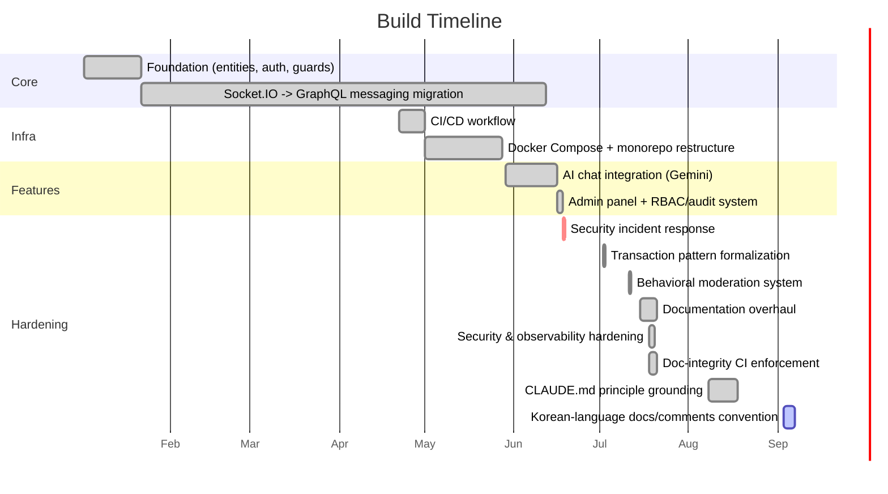

# Roadmap

## Build Timeline (2026-01 ~ 2026-09)

How this project actually got here — phases reconstructed from `git log`, not
recollection. Dates are when each phase's defining commit landed; several phases overlap rather than
running cleanly end-to-end (the Socket.IO→GraphQL migration in particular took ~5 months to fully
land). For the full commit-by-commit record, see [CHANGELOG.md](CHANGELOG.md).

1. **Foundation** (2026-01-02 ~ 2026-01-21) — first commit: "Built user, auth, chat entities,
   relations, guard, interceptors, etc." Base JWT auth, TypeORM entities, and an initial Socket.IO
   chat prototype.
   *Why:* practicing authentication/authorization end-to-end (Basic/Bearer/JWT, RBAC guards) —
   per README's [Project Motivation](README.md#project-motivation) — before building anything else on
   top of it.

2. **Socket.IO → GraphQL messaging migration** (2026-01-22 ~ 2026-06-11) — the longest-running phase,
   not a clean cutover. GraphQL message delivery testing started 2026-01-22 ("Testing Socket through
   GraphQL real time responses"); an early transaction implementation for `sendMessage` landed
   2026-03-01; the old Socket.IO message handler wasn't actually deleted until 2026-06-11 ("unused WS
   sendMessage handler and Socket.IO broadcast removed") — meaning both paths coexisted for roughly
   4.5 months before GraphQL became the sole message-delivery path. See [ADR 0004](ADR/0004-graphql-socketio-api-layer-split.md).
   *Why:* to get transactional guarantees around message persistence, and — per Project Motivation —
   "to learn what that kind of change actually costs in a live system, not just on paper."

3. **Deployment infrastructure** (2026-04-22 ~ 2026-05-27) — CI/CD workflow created 2026-04-22,
   Docker Compose added 2026-05-01, then a monorepo restructure (2026-05-13 ~ 2026-05-27) moved
   everything into the current `backend/`/`frontend/` workspace-package layout.
   *Why:* per Project Motivation, "didn't stop at a feature demo" — CI/CD and containerized local dev
   were added the way an actually-deployed service needs them, not as an afterthought.

4. **AI chat integration** (2026-05-29 ~) — Gemini-backed AI companion (`AiService`), first landing
   as "Update: AI Chat Bot for registered users."
   *Why:* not stated in README's Project Motivation notes — the closest documented rationale is the
   cost-capped design itself (token limits, history truncation, retry ceiling), not the decision to
   add AI chat in the first place. Flagging this gap rather than guessing at it.

5. **Admin panel + RBAC/audit system** (2026-06-16 ~ 2026-06-17) — the `admin/` workspace package,
   superadmin role tier, and audit-log system all landed within two days of each other.
   *Why:* same "not a demo" motivation as deployment infrastructure — user/room management and an
   audit trail are what a live, multi-user service actually needs, not a nice-to-have.

6. **Security incident response** (2026-06-18) — "Fix: password leak via missing serializer, stale
   role cache, RBAC bypass on audit log, admin signout method, and bind local dev server to loopback."
   Full write-up in README's [AI-Assisted Development Notes](README.md#ai-assisted-development-notes).
   *Why:* not planned work — a live incident (exposed dev port led to a ransomware bot wiping the dev
   database) that got contained, rotated, and documented end-to-end rather than quietly patched over.

7. **Transaction pattern formalization** (2026-07-02) — `GqlTransactionInterceptor` introduced,
   replacing an inline `dataSource.transaction()` call that had handled `sendMessage` until then. See
   [ADR 0003](ADR/0003-database-transaction-strategy.md).
   *Why:* per ADR 0003's Context, multi-table writes without a shared `QueryRunner` orphan partial
   state on failure — centralizing open/commit/rollback/release behind one interceptor closes that gap
   for every future multi-write mutation, not just the one that prompted it.

8. **Behavioral moderation system** (2026-07-11) — strike accrual + escalation ladder
   (warn → mute → timed ban → permanent ban). See [ADR 0006](ADR/0006-moderation-one-directional-dependency.md).
   *Why:* same "not a demo" motivation as admin/deployment — abuse prevention a live, publicly
   registrable chat app actually needs once real users can message each other unsupervised.

9. **Documentation overhaul** (2026-07-15 ~ 2026-07-20) — README rewrite, then this
   ARCHITECTURE/CONTRIBUTING/ROADMAP/CHANGELOG suite, plus an ADR set that grew from CLAUDE.md's
   original 5 decisions to 21 — each with a Korean `.ko.md` pair. Ongoing edits after 2026-07-20
   count as maintenance under phase 11, not a continuation of this phase.
   *Why:* conventions and architecture decisions had accumulated implicitly across code comments and
   one large CLAUDE.md as the project grew past a single-file README — including gaps CLAUDE.md itself
   had (e.g. no mention of `ModerationModule` or the `admin/` workspace) — surfaced and fixed while
   building this suite rather than left to drift further.

10. **Security & observability hardening** (2026-07-18 ~ 2026-07-19) — Helmet security headers and
    `trust proxy`, IP-keyed rate limiting on `signin`/`register` (see
    [ADR 0020](ADR/0020-security-headers-and-auth-rate-limit.md)), CSP for `frontend`/`admin`, 23
    dependency vulnerabilities patched (5 high), a liveness `/health` endpoint wired into Railway's
    healthcheck, log persistence across redeploys ([ADR 0018](ADR/0018-railway-volume-log-persistence.md)),
    Sentry error tracking ([ADR 0019](ADR/0019-sentry-error-tracking.md)), and Dependabot.
    *Why:* per ADR 0019's Context, metrics, tracing, and error grouping were absent monorepo-wide —
    ADR 0018 had made logs durable, but a durable `error.logs.log` still requires someone to know to
    go look at it. The 2026-06-18 incident got contained, but nothing then in place would have
    surfaced the next one unprompted. Scope was deliberately narrowed to error tracking on the
    backend only; `frontend`/`admin` error tracking remains a deferred, separate task.

11. **Doc-integrity CI enforcement** (2026-07-18 ~ ) — `pnpm check:adr` (broken links/anchors, stale
    line citations, nearby-symbol content match, missing `.ko.md` pairs, EN/KO heading-structure
    parity), `pnpm check:config` (`MODERATION_DEFAULTS` across its 4 documented mirrors),
    `pnpm check:deps` (README's dependency lists vs `backend/package.json`), and
    `pnpm check:changelog` (every commit has a matching entry in both CHANGELOG languages) — all
    wired into the blocking `test` job.
    *Why:* the phase-9 suite cites specific `file:line` locations throughout, and several were
    already stale within days of being written (`5759009` fixed 4 such citations in CLAUDE.md
    itself). Prose conventions don't survive a moving codebase — the accuracy claims had to become
    machine-checked or they would rot silently, which is worse than having no citation at all.

12. **CLAUDE.md principle grounding** (2026-08-08 ~ 2026-08-17) — every entry in CLAUDE.md's
    Engineering Principles section (SOLID, DIP/IoC, OCP, LSP, Unix Philosophy, Design by Contract,
    Safe Defaults, Avoid Premature Optimization, Robustness Principle, Defensive Programming, and
    others) was tied to a concrete, already-existing instance in this codebase or explicitly marked
    "not adopted," resolving two Principle Conflict Protocol cases that had been left unresolved.
    Also: `RUNTIME_ENV` split from `NODE_ENV` ([ADR 0022](ADR/0022-node-env-runtime-env-split.md)) —
    `NODE_ENV` alone couldn't distinguish "inside docker-compose" from "bare `pnpm start:dev`" for
    `envFilePath`/host-binding decisions.
    *Why:* a principle listed without a grounded local example is exactly the kind of
    unverifiable claim phase 11 was built to catch for code citations — restating "SOLID" or
    "Design by Contract" by name isn't a project-specific convention until it points at what in
    *this* codebase actually follows it, or explains why it doesn't.

13. **Korean-language docs/comments convention** (2026-09-03 ~ 2026-09-06) — CLAUDE.md gained a
    Writing Style section requiring code comments and commit messages in Korean, in the terse
    nominalized `-함/임/음` register rather than polite `-습니다` prose or AI-toned filler. Applied
    across the whole monorepo: every backend service/guard/DTO/entity, frontend and admin source,
    unit-test specs, Playwright e2e suites, build/infra scripts (`scripts/*.mjs`, GitHub Actions,
    Dockerfile, docker-compose), and `.env.example` files — translating genuine WHY comments and
    removing pure WHAT-narration/filler (but not comments describing dead code or since-corrected
    mistakes). All 28 `.ko.md` docs converted to the same terse register. `CHANGELOG.md`/`.ko.md`
    backfilled with 26 commits `check:changelog` had caught as unrecorded. Comment-line churn from
    this phase shifted several `file:line` citations in ADRs/CLAUDE.md/ARCHITECTURE.md that
    `check:adr`'s symbol-matching couldn't catch automatically — found via full manual re-audit and
    corrected.
    *Why:* this is a solo project with a Korean-speaking maintainer and an already-Korean app UI;
    code comments defaulting to English (much of it leftover tutorial-style boilerplate from early
    development) didn't match either the UI language or the terse WHY-only bar the rest of CLAUDE.md
    already enforced.

## Planned

Carried over from README's former "Scale Up In Future" section — a backlog, not a committed
timeline or priority order.

### Backend

- Last message and unread count on the conversation list — the list itself already exists
  (`getMyRooms`, `chat.service.ts`), but returns only `{ roomId, recipientId }`; what's missing is
  the last-message preview and the unread count, not the list. Scope not yet decided; likely
  direction is a per-participant "last read" timestamp, but the exact schema (column on the
  existing participants join table vs. a separate read-receipt table) is still open.
- Group chat rooms (broadcast via `roomId` to multiple participants) — `RoomEntity.participants` is
  already `@ManyToMany` so the data model supports it, but `findRoom`/`getRoom`/`createRoom`
  (`chat.service.ts`) are currently hardcoded to exactly two participants and would need a real
  redesign, not an extension. `getMyRooms` is a fourth, quieter call site: it picks the recipient as
  `participants.find(p => p.id !== userId)`, so on a 3+ participant room it would return one
  arbitrary participant rather than failing. Current direction: room creator is the only one who can
  invite new participants (no open-invite model).
- Let users delete rooms and conversation history — an admin-only `deleteRoom` mutation already
  exists (`chat.resolver.ts`, `@RBAC(UserRole.admin)`), but it hard-deletes the room for everyone;
  there is no user-facing path. Current direction for the user-facing one: if the room's creator
  deletes it, it's marked deleted for all participants; if a non-creator participant deletes it, only
  that participant leaves (the room persists for the others). Open question this raises: whether the
  existing admin hard-delete should converge on the same soft-delete mechanic or stay a distinct
  operation. Exact mechanics (schema, cascade behavior) not yet designed.
- "User is typing" indicator — direction: keep it on the GraphQL Subscription channel (same as
  `receiveMessage`) rather than adding it to Socket.IO, to stay consistent with
  [ADR 0004](ADR/0004-graphql-socketio-api-layer-split.md)'s "Socket.IO carries no chat-message
  traffic" boundary.
- Auth/rate-limit on `ping`, `getAiUserId`, `getSystemUserId` — resolved 2026-09-16.
  `getAiUserId`/`getSystemUserId` now carry `@UseGuards(GraphQLAuthGuard, QueryRateLimitGuard)`
  (`chat.resolver.ts`), matching the `getAiPersonalityInfo` pattern; traced call sites confirmed
  `frontend/src/pages/chat-page.tsx` only calls them from behind `ProtectedRoute`, and `admin/` never
  calls them, so no unauthenticated flow depended on the old behavior. `ping` is left unguarded on
  purpose — it's documented in README.md as an unauthenticated health check, mirrors the same
  intentional no-guard pattern already used by the REST `/health` liveness endpoint
  (`health.controller.ts`), and does no DB/Redis/compute work, so the exposure is equivalent to that
  endpoint's. Note: `QueryRateLimitGuard` couldn't be bolted onto `ping` alone even if desired — it
  throws 401 when `req.user.id` is absent (`query-rate-limit.guard.ts:33-37`), so pairing it with an
  unauthenticated query isn't possible without a new IP-based limiter, which is out of scope here.
- `QueryRateLimitGuard` (or equivalent) on the `receiveMessage` subscription — every other
  authenticated GraphQL entrypoint now carries a rate-limit guard (`QueryRateLimitGuard` or
  `RateLimitGuard`) except this one. Its `canActivate` only runs once per subscribe, so the guard
  would throttle resubscribe attempts, not per-message delivery volume — whether that's worth adding
  on its own is not yet decided.

### Frontend

- Unread message count badge on the chat room list — the room list UI itself already renders from
  `getMyRooms` (`chat-page.tsx`); only the unread badge is missing, and it is blocked on the backend
  item above.

### Code quality & consistency backlog (2026-09 audit)

Findings from a whole-app dependency/consistency sweep (2026-09-14/15) that traced every file's
actual call chain, cross-checked header comments against real consumers, and diffed generated
artifacts (`schema.gql`) against their sources. The five findings with real runtime/security impact
(stale `user_cache` on user deletion, missing entities in `data-source.ts`'s migration `DataSource`,
an unhandled-rejection path in `sendMessage`, `frontend`'s missing CI lint/test gate, admin's missing
cross-tab session marker on login) were fixed the same week — see `CHANGELOG.md` around `851f765`..
`d0ad00a`. What's below is the rest: real but lower-impact, left as a backlog rather than fixed
immediately. Two items originally flagged as "needs cross-module check" — admin's `AdminRoomType`/
`RoomInfoType` field usage against `schema.gql`, and the `getAllRooms`/`deleteRoom`/`getOnlineUser`/
`getUserNicknames` resolver guard levels against what `admin/` actually requires — were re-checked
and found consistent; not listed here.

**Backend**
- `auth/guard/rbac.guard.ts`'s `accessLevel` map (`:37,44`) is an identity map over a `UserRole`
  numeric enum that already equals itself — `GraphQLRBACGuard` implements the same check directly
  (`user.role ?? UserRole.user >= role`) with no map. Drop the map, compare directly.
- `moderation/constants/moderation.constants.ts`'s header (`:3`) claims `moderation.guard.ts` as a
  consumer; the guard doesn't import it by design (SRP — threshold logic stays in the service). The
  header omits the real second consumer, `user.service.ts`'s `SYSTEM_USER_EMAIL` import.
- `user/user.service.ts`'s `create()` (`:50`) has no controller route calling it — registration goes
  through `AuthService.register()`, which duplicates the same email/nickname-check + bcrypt-hash +
  save logic independently. Confirm an intended caller (an admin-create-user endpoint?) or remove it.
- `user.service.ts`'s `remove()` issues one `COUNT` query per room the deleted user belonged to (N+1
  shape) before cleaning up orphaned rooms. Low urgency — this is a 1:1 chat app, so per-user room
  counts stay small.
- `graphql/base.type.ts`'s `BaseType` (`:3-8`, `created`/`updated`) is inherited by `UserType` but
  never reaches the generated `schema.gql` — worth finding out why code-first generation drops it
  before deciding whether to fix generation or delete the dead fields.
- `auth/dto/token-types.auth.dto.ts`'s `tokenType` (`:11`) has no consumer anywhere in the repo; only
  its sibling `bearerTokenType` is used.
- `ai/enums/ai-personality.enum.ts`'s `AI_PERSONALITY_LABELS` (`:12`) has no consumer — `frontend/`
  hardcodes personality labels independently instead of importing this as the source of truth.
- `mail/mail.service.ts` (`:28-29`) reads `SMTP_PORT` from `ConfigService` twice in adjacent lines to
  derive `port` and `secure`.

**Frontend**
- `api/apollo.ts`'s `errorLink` (`:17-30`) never calls `observer.error`/`observer.complete` when a
  silent token refresh fails — it just returns, leaving the Observable (and whatever query/mutation
  was waiting on it) unresolved. `admin/src/api/apollo.ts`'s otherwise-identical `errorLink` does call
  `observer.error(error)` in the same branch; bring `frontend/`'s in line with it.
- `pages/chat-page.tsx`'s `handlePersonalitySelect` (`:441-446`) has no `onError` on its mutation and
  no try/catch around the `await` — a failed personality change fails silently, against this file's
  own convention for user-visible mutation failures.
- The same inline API-error type cast — `(err as { response?: { data?: { message?: ... } } })` — is
  hand-written 5 times across `account-page.tsx` (`:79,112`), `register-page.tsx` (`:35`), and
  `signin-page.tsx` (`:48,50`) instead of using `axios.isAxiosError()`. Extract one
  `getApiErrorMessage(err)` helper.
- `App.tsx:12-13` declares two `<Route path='/'>` siblings; the second (a placeholder
  `
Login Page
`) is permanently unreachable, and a matching commented-out remnant sits at
  `:17`. Both are scaffold leftovers to delete.
- `useAuthStore()` is called without a selector at 5 call sites (`account-page.tsx:18`,
  `chat-page.tsx:84-85`, `signin-page.tsx:17`, `protected-route.tsx:7`), subscribing each component to
  the whole store instead of the fields it reads.
- `main.tsx:8`'s `document.getElementById('root')!` is a non-null assertion (Never Do Group 1) — low
  real risk since `index.html` guarantees the element, but still worth narrowing explicitly.
- `package.json:35`'s `@testing-library/user-event` devDependency has no import site anywhere in
  `frontend/src`.
- `pages/chat-page.tsx`'s `signOut` (`:525-530`) has a comment-only empty `catch` block — the intent
  (best-effort sign-out on an already-expired token) is legitimate but the shape matches the forbidden
  empty-catch pattern literally.

**Admin**
- None of the 4 `signOut` handlers (`dashboard-page.tsx`, `logs-page.tsx`, `rooms-page.tsx`,
  `users-page.tsx`) call `clearSessionUser()` — only `clearTokens()`. Signing out and back in as a
  different admin in the same tab leaves a stale session marker that can make the next silent refresh
  misread the new, legitimate login as a cross-tab conflict.
- `admin/e2e/users.spec.ts` has no case covering `demoteSuperadmin` (`users-page.tsx`) — the newest
  privileged action and, per CLAUDE.md's Compromised Superadmin Containment, the only in-app recovery
  path for a compromised superadmin account.
- The `actionColor`/`ACTION_COLOR` action-to-badge-color mapping is implemented 3 separate ways across
  `dashboard-page.tsx:69`, `logs-page.tsx:121`, and `users-page.tsx:43` (two as an if/else chain, one
  as a `Record`), alongside duplicated nav/sign-out JSX across all 4 pages with no shared component.
- `admin/e2e/seed-superadmin.mjs:36` hardcodes `bcrypt.hash(password, 10)` instead of reading
  `HASH_ROUNDS` (12 in CI) — low risk since this is an ephemeral CI fixture DB, but silently diverges
  from the single-source-of-truth env convention.

**Docs**
- CLAUDE.md's CI/CD section lists the `test` job's steps through `check:deps` but omits
  `check:changelog`, which `deploy.yml:46` actually runs as part of the same job.

### Dev environment tooling

- OS-level sandboxing (`sandbox.enabled` in `.claude/settings.local.json`) — reviewed 2026-09-16,
  not adopted. Official Claude Code docs confirm the sandbox does not run on native Windows
  (bubblewrap requires Linux/WSL2, Seatbelt is macOS-only), and this dev machine runs Windows 10
  natively. Revisit if this environment ever moves to WSL2. Until then, `.claude/settings.local.json`'s
  command-pattern `deny`/`allow`/`ask` rules are the sole enforcement layer — known limitation:
  Bash/PowerShell rule matching is on literal command text/prefix, not semantic, so a differently-quoted
  or aliased command can slip past a specific `deny` entry. `defaultMode: "default"` bounds the actual
  exposure to whatever sits in the `allow` list, since anything else still prompts for confirmation.

## Related documents

- [README.md](README.md) — current feature set
- [ARCHITECTURE.md](ARCHITECTURE.md) — system structure these items would extend
- [CHANGELOG.md](CHANGELOG.md) — full commit-by-commit record
