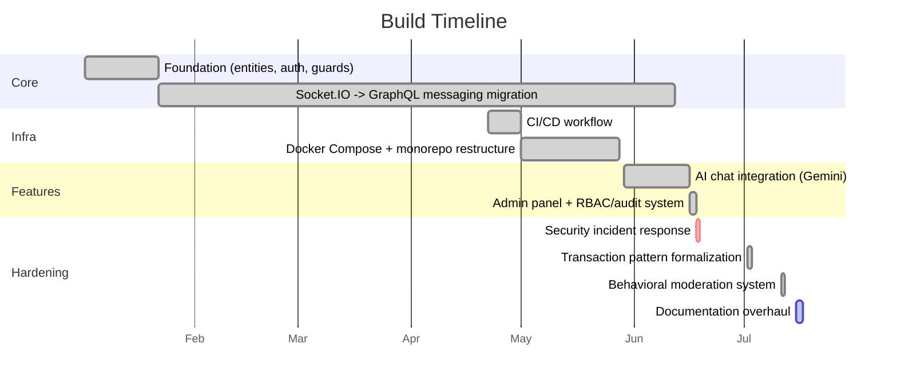

# Roadmap

## Build Timeline (2026-01 ~ 2026-07)

How this project actually got here — phases reconstructed from `git log` (573 commits), not
recollection. Dates are when each phase's defining commit landed; several phases overlap rather than
running cleanly end-to-end (the Socket.IO→GraphQL migration in particular took ~5 months to fully
land). For the full commit-by-commit record, see [CHANGELOG.md](CHANGELOG.md).

1. **Foundation** (2026-01-02 ~ 2026-01-21) — first commit: "Built user, auth, chat entities,
   relations, guard, interceptors, etc." Base JWT auth, TypeORM entities, and an initial Socket.IO
   chat prototype.
   *Why:* practicing authentication/authorization end-to-end (Basic/Bearer/JWT, RBAC guards) —
   per README's [Project Motivation](README.md#project-motivation) — before building anything else on
   top of it.

2. **Socket.IO → GraphQL messaging migration** (2026-01-22 ~ 2026-06-11) — the longest-running phase,
   not a clean cutover. GraphQL message delivery testing started 2026-01-22 ("Testing Socket through
   GraphQL real time responses"); an early transaction implementation for `sendMessage` landed
   2026-03-01; the old Socket.IO message handler wasn't actually deleted until 2026-06-11 ("unused WS
   sendMessage handler and Socket.IO broadcast removed") — meaning both paths coexisted for roughly
   4.5 months before GraphQL became the sole message-delivery path. See [ADR 0004](ADR/0004-graphql-socketio-api-layer-split.md).
   *Why:* to get transactional guarantees around message persistence, and — per Project Motivation —
   "to learn what that kind of change actually costs in a live system, not just on paper."

3. **Deployment infrastructure** (2026-04-22 ~ 2026-05-27) — CI/CD workflow created 2026-04-22,
   Docker Compose added 2026-05-01, then a monorepo restructure (2026-05-13 ~ 2026-05-27) moved
   everything into the current `backend/`/`frontend/` workspace-package layout.
   *Why:* per Project Motivation, "didn't stop at a feature demo" — CI/CD and containerized local dev
   were added the way an actually-deployed service needs them, not as an afterthought.

4. **AI chat integration** (2026-05-29 ~) — Gemini-backed AI companion (`AiService`), first landing
   as "Update: AI Chat Bot for registered users."
   *Why:* not stated in README's Project Motivation notes — the closest documented rationale is the
   cost-capped design itself (token limits, history truncation, retry ceiling), not the decision to
   add AI chat in the first place. Flagging this gap rather than guessing at it.

5. **Admin panel + RBAC/audit system** (2026-06-16 ~ 2026-06-17) — the `admin/` workspace package,
   superadmin role tier, and audit-log system all landed within two days of each other.
   *Why:* same "not a demo" motivation as deployment infrastructure — user/room management and an
   audit trail are what a live, multi-user service actually needs, not a nice-to-have.

6. **Security incident response** (2026-06-18) — "Fix: password leak via missing serializer, stale
   role cache, RBAC bypass on audit log, admin signout method, and bind local dev server to loopback."
   Full write-up in README's [AI-Assisted Development Notes](README.md#ai-assisted-development-notes).
   *Why:* not planned work — a live incident (exposed dev port led to a ransomware bot wiping the dev
   database) that got contained, rotated, and documented end-to-end rather than quietly patched over.

7. **Transaction pattern formalization** (2026-07-02) — `GqlTransactionInterceptor` introduced,
   replacing an inline `dataSource.transaction()` call that had handled `sendMessage` until then. See
   [ADR 0003](ADR/0003-database-transaction-strategy.md).
   *Why:* per ADR 0003's Context, multi-table writes without a shared `QueryRunner` orphan partial
   state on failure — centralizing open/commit/rollback/release behind one interceptor closes that gap
   for every future multi-write mutation, not just the one that prompted it.

8. **Behavioral moderation system** (2026-07-11) — strike accrual + escalation ladder
   (warn → mute → timed ban → permanent ban). See [ADR 0006](ADR/0006-moderation-one-directional-dependency.md).
   *Why:* same "not a demo" motivation as admin/deployment — abuse prevention a live, publicly
   registrable chat app actually needs once real users can message each other unsupervised.

9. **Documentation overhaul** (2026-07-15 ~ ) — README rewrite, then this ARCHITECTURE/CONTRIBUTING/
   ROADMAP/CHANGELOG/ADR suite.
   *Why:* conventions and architecture decisions had accumulated implicitly across code comments and
   one large CLAUDE.md as the project grew past a single-file README — including gaps CLAUDE.md itself
   had (e.g. no mention of `ModerationModule` or the `admin/` workspace) — surfaced and fixed while
   building this suite rather than left to drift further.

## Planned

Carried over from README's former "Scale Up In Future" section — a backlog, not a committed
timeline or priority order.

### Backend

- Store conversation list per user (last message, unread message count, etc) — scope not yet decided;
  likely direction is a per-participant "last read" timestamp, but the exact schema (column on the
  existing participants join table vs. a separate read-receipt table) is still open.
- Group chat rooms (broadcast via `roomId` to multiple participants) — `RoomEntity.participants` is
  already `@ManyToMany` so the data model supports it, but `findRoom`/`getRoom`/`createRoom`
  (`chat.service.ts`) are currently hardcoded to exactly two participants and would need a real
  redesign, not an extension. Current direction: room creator is the only one who can invite new
  participants (no open-invite model).
- Let users delete rooms and conversation history — current direction: if the room's creator
  deletes it, it's marked deleted for all participants; if a non-creator participant deletes it, only
  that participant leaves (the room persists for the others). Exact mechanics (schema, cascade
  behavior) not yet designed.
- "User is typing" indicator — direction: keep it on the GraphQL Subscription channel (same as
  `receiveMessage`) rather than adding it to Socket.IO, to stay consistent with
  [ADR 0004](ADR/0004-graphql-socketio-api-layer-split.md)'s "Socket.IO carries no chat-message
  traffic" boundary.

### Frontend

- Chat room list UI with unread message count — blocked on the backend conversation-list item above.

## Related documents

- [README.md](README.md) — current feature set
- [ARCHITECTURE.md](ARCHITECTURE.md) — system structure these items would extend
- [CHANGELOG.md](CHANGELOG.md) — full commit-by-commit record
